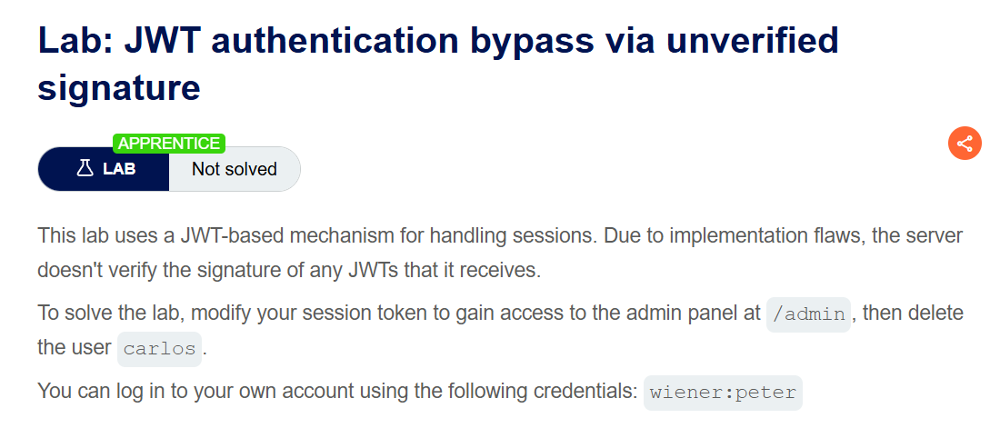

# JSON Web Token

# **1. JWT là gì?**

Theo PortSW định nghĩa thì JWT là một định dạng đã được tiêu chuẩn hoá để gửi dữ liệu JSON được ký bằng các mật mã giữa các hệ thống. Theo lý thuyết thì JWT có thể chứa bất kỳ loại dữ liệu nào, nhưng được sử dụng phổ biến nhất để gửi thông tin xác nhận về người dùng.

### So sánh một tí về cơ chế hoạt động của Session và JWT:

`So với Session token truyền thống`, khi người dùng đăng nhập thành công, Server phải tạo bản ghi về phiên làm việc (lưu thông tin người dùng) trong bộ nhớ hoặc cơ sở dữ liệu. Đồng thời, Server gửi về trình duyệt một mã định danh gọi là Session ID thường được lưu trong Cookie. Ở những lần truy cập tiếp theo, trình duyệt gửi lại Session ID này để Server tra cứu và xác định người dùng.

`Session hoạt động` dựa trên việc Server lưu trữ trạng thái, nghĩa là toàn bộ dữ liệu đăng nhập được giữ ở phía Server. Các làm này an toàn vì Client chỉ giữ mã định danh không giữ thông tin người dùng, tuy nhiên khi làm gì cũng phải truy vấn đến Server.

`Nếu Apps/Web` có nhiều người dùng hoặc chạy trên nhiều máy chủ thì việc đồng bộ giữa các phiên làm việc sẽ tốn chi phí và thời gian.

`Cơ chế hoạt động của JWT`, khi người dùng xác thực, Server kí bằng khoá bí mật và gửi lại cho Client. Token này thường được lưu trong localStorage hoặc Cookie. Ở những yêu cầu tiếp theo, Client gửi Token trong HTTP Header. Server chỉ việc kiểm tra **chữ ký (Signature) để xác minh.** Nếu chữ ký hợp lệ, server tin tưởng tuyệt đối dữ liệu bên trong.

Điều này giúp JWT phù hợp với các ứng dụng sử dụng nhiều Service, hoặc cần tính mở rộng và giảm tải cho Server.

### **Cấu trúc của JWT (3 phần ngăn cách bằng dấu chấm):`Header.Payload.Signature`**

1. **Header :** Nói cho server biết dùng thuật toán gì để kiểm tra chữ ký (**`alg`**) và loại token (**`typ`**).
    - *Lưu ý:* Nơi khai báo thuật toán là điểm yếu chí mạng nếu server không validate chặt.
2. **Payload:** Dữ liệu thực sự (User ID, Role, Expire time...).
    - *Lưu ý:* Chỉ là Base64 Encode, **KHÔNG MÃ HÓA**. Ai cũng đọc được -> Đừng bỏ mật khẩu vào đây.
3. **Signature:** Phần quan trọng nhất. Được tạo bằng cách hash **`(Header + Payload)`** với một **`Secret Key`**. Đôi khi, trong 1 số trường hợp người ta cũng đi encrypt kết quả của phần Hash.

### **`JWT/JWS/JWE/JWK/JWA`**

- JWT: JSON Web Token (claims container)
- JWS: Signed JWT -> integrity
- JWE: Encrypted JWT -> confidentiality
- JWK: JSON Web Key (key format)
- JWA: JSON Web Algorithms (algs)

### `JWT vs JWS vs JWE`

- JWT là data.
- JWS là data đã ký.
- JWE là data đã mã hoá.

```
90% JWT gặp là JWS.
Đếm số phần .: 3 -> JWS, 5 -> JWE.
JWS: đọc payload, tấn công integrity/signature.
JWE: không đọc payload, tấn công key management, config
```

# **2. JWT attacks là gì?**

JWT attacks là khi người dùng gửi các JWT đã được chỉnh sửa tới server để đạt được mục đích độc hại. Thông thường, mục đích đó là bypass xác thực và kiểm soát truy cập bằng cách mạo danh người dùng khác đã được xác thực trước đó.

# **3. Tác động của JWT attacks là gì?**

Tác động của JWT attacks thường nghiêm trọng. Nếu kẻ tấn công có thể tự tạo token hợp lệ với giá trị bất kỳ, chúng có thể leo thang đặc quyền hoặc mạo danh người dùng khác, từ đó chiếm toàn bộ quyền kiểm soát tài khoản của họ.

# **4. Lỗ hổng JWT attacks xuất phát từ đâu?**

Lỗ hổng JWT thường xuất phát từ cách ứng dụng xử lý JWT chưa chặt chẽ. Các đặc tả liên quan đến JWT khá linh hoạt, cho phép nhà phát triển tự quyết định nhiều chi tiết triển khai. Điều này dễ dẫn đến việc vô tình đưa lỗ hổng vào ngay cả khi dùng các thư viện khá an toàn.

Các lỗi triển khai thường khiến chữ ký của JWT không được kiểm tra đúng cách. Điều này cho phép kẻ tấn công can thiệp vào giá trị trong payload của token. Ngay cả khi chữ ký được kiểm tra kỹ, độ tin cậy vẫn phụ thuộc rất nhiều vào việc secret key của server phải giữ bí mật. Nếu khóa này bị lộ, đoán được hoặc brute‑force được, kẻ tấn công có thể tạo chữ ký hợp lệ cho bất kỳ token nào, làm toàn bộ data.

# **5. Attack Vectors**

Mình đi theo các hướng sau:

### **Server quên kiểm tra chữ ký (Basic)**

Tương tự như việc đưa căn cước giả nhưng cảnh sát không soi mà chỉ nhìn sơ qua ảnh thôi.

- **Unverified Signature:** Thay Payload (**`"role": "admin"`**), giữ nguyên Signature cũ, gửi đi. Nếu server không kiểm tra kỹ, nó sẽ chấp nhận.
- **Alg: None:** Gửi Header đổi thuật toán thành **`"alg": "none"`**. Xóa phần Signature đi (để trống hoặc xóa hẳn).
    - *Payload:* **`{"alg":"none", "typ":"JWT"}`** (Base64) . **`{"sub":"admin"}`** (Base64) . (Rỗng).
    - Một số thư viện cũ sẽ không xác thực lại mà chỉ chấp nhận.

### **Server bị lừa về thuật toán (Algorithm Confusion)**

Đây là bug logic.

- **Tình huống:** Server dùng RSA (Asymmetric - Private key ký, Public key verify). Attacker đổi **`alg`** từ **`RS256`** sang **`HS256`** (Symmetric - 1 key dùng cho cả 2).
- **Khai thác:**
    1. Lấy Public Key của server (thường tìm ở **`/.well-known/jwks.json`** hoặc certificate SSL).
    2. Đổi **`alg`** trong Header thành **`HS256`**.
    3. Dùng chính **Public Key** đó làm **`Secret Key`** để ký token mới.
    4. Server verify bằng Public Key -> Khớp -> Bypass.

### **Weak Secret (Brute Force)**

Nếu server dùng thuật toán đối xứng (HS256) và **`Secret Key`** quá yếu (ví dụ: "123456", "password").

- **Cách đánh:** Dùng **`hashcat`** hoặc **`john`** để crack hash JWT.
- **Tool:** **`hashcat -m 16500 jwt.txt wordlist.txt`**
- Sau khi có secret -> Tự ký token admin thoải mái.

### **Injection vào Header (Advance)**

Đánh vào cách server xử lý Header để tìm Key.

- **Kid Injection (Key ID):**
    - Header thường có field **`kid`** (Key ID) để server biết lấy key nào trong kho ra verify.
    - Nếu server dùng **`kid`** để đọc file: **`file_get_contents($path . $kid)`**.
    - **Exploit:** Sửa **`kid`** thành **`/dev/null`** hoặc **`/proc/sys/kernel/random/uuid`** (file có nội dung biết trước/rỗng).
    - Ký token với Secret là nội dung của file đó -> Bypass.
    - Thậm chí có thể SQL Injection vào **`kid`** nếu server query DB.
- **JWK / JKU Spoofing:**
    - Server cho phép token tự mang theo Public Key (JWK header) hoặc trỏ đến một URL chứa Key (JKU).
    - **Exploit:** Tự gen cặp key, nhét Public Key vào Header JWK hoặc host JKU của mình, dùng Private Key ký token. Server tin key của mình -> Bypass.

# **6.  Tools**

Không cần code thủ công, dùng tool cho nhanh:

1. **Burp Suite Extension: JWT Editor** (Bắt buộc phải có).
    - Cài trong BApp Store.
    - Cho phép edit Header/Payload trực tiếp, gen key, ký lại token (Sign) chỉ bằng 1 click.
2. **jwt_tool** (Command line - Python).
    - **`python3 jwt_tool.py <token> -C -d wordlist.txt`** (Crack).
    - Tự động exploit các lỗi **`alg:none`**, key confusion,.....

# 7. Các bài lab trên PortSwigger

## **Lab: JWT authentication bypass via unverified signature**

Lổ hổng: Do lỗi triển khai, mà server không xác thực bất kì signature nào của JWT mà nó nhận được.

Mục tiêu: truy cập vào được admin panel tại `/admin` và xoá user `carlos`.



### Tổng quan:

Khi truy cập vào bài lab, lướt tới lướt lui thì mình thấy toàn các bài Blog. Bấm vào đọc thì thấy có mục comment đồ, nhưng vì đây là topic về JWT Attack và dựa theo mô tả của bài lab : D nên mình quyết định đi đến phần đăng nhập.


Mình đăng nhập vào credentials `wiener:peter`  được cung cấp. 


### Khai thác:

Quan sát trên tab HTTP history của burp, mình thấy có một Request với method Post được gửi đi khi mình Login. Sau đó là một request GET trang đăng nhập sau khi xác thực. Nhìn kĩ phần request ở phần Cookie, session được lưu là JWT.


Gửi request đến tab repeater và nhấn send. Nhìn bên tab của extension JWT Editor thì thấy nó lộ tùm lum hết rồi.


Ở Payload trong JWS có mục `“sub”:”wiener”` . Đây có vẻ như trường để xác nhận xem người đăng nhập là ai. Nhìn có vẻ tìm năng nên mình đổi cred `wiener`thành `administrator`.


Bấm sign rồi gửi lại request. Sau đó mình thấy bên response lồi ra cái Admin panel rồi.


Okay bây giờ mình có phiên làm việc của admin rồi, sửa request thành `GET /admin` và xoá cred `carlor`là done.


## **Lab: JWT authentication bypass via flawed signature verification**

Lổ hổng: Server cấu hình không an toàn nên chấp nhận JWT chưa ký.

Mục tiêu: truy cập vào được admin panel tại `/admin` và xoá user `carlos`.


Do đọc mô tả và thấy mục tiêu của bài lab giống bài lab đầu tiên làm, nên mình bay vô chổ tình nghi nhất là nằm ở chổ sau khi xác thực bằng cred **`wiener:peter` .**  Quan sát HTTP history trên burp, mình tiếp tục tìm đến request `GET /my-account?id=wiener` .


Gửi request qua tab repeater. Lần này mình thử chuyển cái path sang `/admin` luôn coi được không. Thì bị chặn và response nhận được là 401. Có vẻ như ta phải xác thực là admin thì mới truy cập được.


Mình thử dùng cách tương tự ở bài lab đầu tiên. Sửa `“sub”:”wiener”` của JWT trong session thành administrator. Và cách này không hiệu quả, mình vẫn bị chặn.


Nhìn lại tên bài lab thấy tên bài lab có phần “xác minh chữ ký thiếu sót”, nên mình mò đến phần header và sửa  `"alg":"none”` ( alg dùng để chỉ định **thuật toán ký / mã hóa** được dùng để bảo vệ JWT). Vì set alg thành none rồi nên mình xoá luôn phần signature.


Apply changes và gửi request. Mình đăng nhập vào /admin thành công. Xoá cred theo yêu cầu của bài lab là hoàn thành.


## **Lab: JWT authentication bypass via weak signing key**

Lổ hổng: do ứng dụng sử dụng secret key siêu yếu để ký và xác minh, nó có thể dễ dàng bị brute-forced.

Mục tiêu: truy cập vào được admin panel tại `/admin` và xoá user `carlos`.


Vẫn như vậy mình lại login vào cred `wiener:peter` và tìm đến cái request đó.


Lần này mình để ý thấy phần signature của JWT trong session khá ngắn. Có vẻ cái JWT này yếu yếu, mình copy JWT và đi brute-force cái secret key của nó (do thấy tên bài mô tả thế 🙉).


Chạy hashcat trên kali và chờ đợi. Nổ rồi 


Dựa vào secret key tìm được là `secret1` . Mình đi làm lại các bước đổi `“sub”:”wiener”` thành administrator và tính ký lại bằng secret key tìm được.


Bấm send request và truy cập thành công vào /admin. Từ đây đi xoá cred là thành công hoàn thành bài.


## **Lab: JWT authentication bypass via jwk header injection**

Lổ hổng: Server hổ trợ tham số jwk trong JWT Header, điều này đôi khi được sử dụng để nhúng khoá xác minh vào trực tiếp token, tuy nhiên Server lại không kiểm tra kĩ xem liệu khoá này có đến từ một nguồn đáng tin cậy hay không.

Mục tiêu: truy cập được admin panel và xoá cred carlos.


### Tổng quan:

Mình có nhìn qua phần Tips thì thấy người ta kêu mình nên học cách sử dụng JWT Editor, nên mình có đi học và biết cách sử dụng nó để sinh ra khoá của bản thân mình.


Truy cập bài lab và mình đăng nhập vào credentials `wiener:peter`  được cung cấp. 


### Khai thác:

Sau khi đăng nhập, quan sát HTTP history trên burp. Lần này mình tiếp tục tìm đến request `GET /my-account?id=wiener`


Dựa theo mô tả về bài lab và vận dụng kiến thức học được khi sử dụng extension `JWT Editors`. Mình đi tạo 1 khoá RSA cho bản thân mình, cái này sẽ được nhúng vào trong jwk ở phần header. Lúc tạo ra khoá thì không cần quan tâm cái key size, phần này sẽ tự động cập nhật.


Vì server sẽ không kiểm tra kĩ key đến từ đâu và an toàn hay không. Nên khi mình `tự tạo cặp khoá RSA riêng`, ký JWT bằng private key của mình, rồi nhét public key dưới dạng `jwk` vào header → server sẽ dùng key này để verify → token sẽ được chấp nhận.

> **jwk** là một **JSON Web Key**, tức là cách biểu diễn khóa công khai dưới dạng JSON (theo chuẩn JWK).
> 

Dựa vào ý tưởng đó gửi request đến tab Repeater, mình đi qua tab JSON Web Token, rồi bấm Attack sau đó chọn Embeded JWK.


Sau khi thực hiện như vậy thì extension tự động thêm phần `jwk` vào trong header. Tiếp theo mình sửa “sub” trong header thành `“sub”:”administrator”` , thay đổi path đến `/admin` và gửi request. Và đã truy cập thành công vào cred admin.


Từ đây xoá cred `carlos` là hoàn thành bài lab.


##