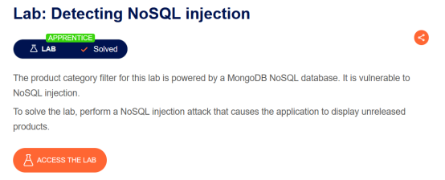

# NoSQL Injection

---

# **Lab 1: Detecting NoSQL injection**

**Mục tiêu:** Khai thác ứng dụng để hiển thị các sản phẩm chưa được phát hành.



**Phân tích & Khai thác:**

- Khi truy cập vào ứng dụng web, tôi tiến hành phân loại sản phẩm để xem thử các request.
- Nhận thấy có một gói tin khá tiềm năng, tôi chuyển nó sang tab `Repeater` và tiến hành tiêm thử các payload.


- Để kiểm tra, tôi thử điền các ký tự dễ gây ra lỗi cú pháp (syntax error) như `“`, `‘`, ```, `{`, `}`, `$`, `;`.
- Kết quả thu được là ký tự `‘` đã gây ra lỗi cú pháp.


- Tiếp theo, tôi thử bypass bộ lọc (filter) và tìm cách trích xuất dữ liệu thông qua các toán tử điều kiện. Dưới đây là các payload tôi đã thử:

`‘ && 1 == 1
‘ && ‘1’ == ‘1
‘ || 1 == 1
‘ || ‘1’ == ‘1
‘ || 1 ||
‘ || 1 || ‘`

**Kết quả:** Quá trình bypass thành công và bài lab được giải quyết.


---

# Lab 2: Exploiting NoSQL operator injection to bypass authentication

**Mục tiêu:** Đăng nhập vào ứng dụng web thông qua tài khoản `administrator`.


**Phân tích & Khai thác:**

- Dựa vào thông tin xác thực (credential) được cung cấp là `wiener:peter`, tôi tiến hành đăng nhập vào tài khoản trên.


- Trong Burp Suite, tôi mở tab **Proxy > HTTP history**.
- Tìm thấy gói tin `POST /login` tiềm năng, tôi gửi nó sang tab `Repeater`.


- Khi gửi gói tin `POST /login` thông thường, response nhận về có mã trạng thái là `302`. Đây là mã phản hồi khi đăng nhập thành công.


- Để kiểm tra xem ứng dụng web có chấp nhận các toán tử trong MongoDB hay không, tôi thử đăng nhập bằng một mật khẩu sai.


- Sử dụng toán tử `$ne` (not equal), tôi xác nhận được ứng dụng web có lỗ hổng NoSQL Injection. Payload bên dưới có nghĩa là yêu cầu đăng nhập vào tài khoản có username là `wiener` và mật khẩu là các mật khẩu không giống với chuỗi `sss`.
- Đăng nhập thành công với mã phản hồi là `302`.


- Tôi thử lại cách trên nhưng sửa `username` thành `administrator`. Ứng dụng phản hồi là không có tài khoản nào tên `administrator`.
- Có nghĩa là phải truy cập vào tài khoản có quyền admin chứ không phải account có tên chính xác là `administrator`.


- Lúc này, tôi sử dụng toán tử `$regex`. Mục tiêu là đăng nhập vào tài khoản nào có tên bắt đầu bằng chữ `a`.
- Payload sử dụng như sau: `{"$regex":"^a.*"}`
- Thành công lấy được ID của tài khoản admin.


**Kết quả:** Sử dụng Cookie của Admin, tôi đã chiếm được phiên làm việc và hoàn thành bài lab.


---

# Lab 3: Exploiting NoSQL injection to extract data

**Mục tiêu:** Khai thác lỗ hổng NoSQL Injection để lấy được mật khẩu của user `administrator`.


**Phân tích & Khai thác:**

- Đăng nhập vào account `wiener:peter`. Sau đó gửi request đến `Repeater`.
- Gửi 1 vài request nhưng không hoạt động do cơ chế bảo vệ CSRF token. Tôi thử chuyển qua 1 vài request `GET` khác.


- Chèn thử payload bên dưới xem phản hồi của ứng dụng: `' && this.password[0] == 'a' || '`
- Payload trên thiết lập điều kiện kiểm tra xem ký tự đầu tiên của mật khẩu có phải bằng ký tự `a` hay không.
- Dĩ nhiên ta biết mật khẩu là `peter`, điều này sẽ gây ra lỗi và trả về `Could not find user`.


- Kiểm tra lại tính chính xác của payload bằng ký tự đúng của mật khẩu là `p`. Payload như sau:

`' && this.password[0] == 'p`


- Dựa vào cách trên, tôi dùng tính năng **Intruder** để dò mật khẩu.
- Đổi tên user lại thành `administrator`. Thiết lập vị trí payload đầu tiên để dò chiều dài của mật khẩu (có thể đặt từ `0` đến `20`), vị trí tiếp theo là brute-force các ký tự của mật khẩu.


- Để phân biệt các mật khẩu đúng, tôi dựa vào thuộc tính `Length` của Request.
- Ký tự đúng ở index của mật khẩu sẽ trả về length là `209`, sai thì trả về `151`.


**Kết quả:** Mật khẩu thu được là: `gmsvmvzq`. Đăng nhập vào credentials `administrator:gmsvmvzq` để hoàn thành bài lab.


---

# Lab 4: Exploiting NoSQL operator injection to extract unknown fields

**Mục tiêu:** Đăng nhập với username là `carlos`. Để làm được điều đó, cần phải tìm được `password reset token`.


**Phân tích & Khai thác:**

- Truy cập vào bài lab không thu được quá nhiều thông tin. Tôi đã thử đăng nhập vào account `carlos` với mật khẩu bất kỳ và được thông báo `Invalid username or password`.


- Trên trang còn có khu vực forgot password yêu cầu nhập vào email để reset. Tuy nhiên ta không thể truy cập vào email của nạn nhân để reset password được.


- Quay lại với gói tin `POST /login`, tôi thử bypass login bằng toán tử `$ne`. Nhận được phản hồi `Account locked`.


- Ở bài lab này, tôi sử dụng toán tử `$where` để xem phản hồi của ứng dụng. Thử payload khác và quan sát ứng dụng thay đổi ra sao khi đổi giá trị của toán tử `$where`:
    - Khi gửi `"$where": "0"` (điều kiện sai) thì nhận được thông báo `Invalid`.
    - Khi gửi `"$where": "1"` (điều kiện đúng) thì nhận được phản hồi `Account locked`.
    - Tức là ứng dụng đã phản hồi theo điều kiện của toán tử `$where`. Từ đây ta có thể sử dụng các function bên trong `$where` để tìm được password reset token.


- Ta đi tìm tên các trường bị ẩn và giá trị của nó. Payload được sử dụng như sau:

`"$where":"function() { if(Object.keys(this)[index].match('field_name') return 1; else 0;}"`

- Cơ chế hoạt động dựa theo hàm `Object.keys()` trả về một array. Từ đây tôi đi tìm tên của các trường dựa vào điều kiện trả về. Đây có thể xem như một dạng **Blind NoSQL Injection**.


- Dựa theo ý tưởng đó, dò được tên trường đầu tiên là `_id`, có thể thử với các index trong array và dò đến khi nào ra được trường password reset token. Tôi có thể đoán đến vị trí số `2` là trường `password`.


- Đến trường số `3` và `4` thì dò sai tên trường sẽ trả về mã `Invalid`, còn dò đến trường có index là `5` thì nhận được mã `Internal Server Error`. Có thể hiểu là chỉ có 2 trường ẩn nằm ở index số `3` và số `4`.


- **Tìm chiều dài tên trường:** Đầu tiên ta dò xem chiều dài của tên trường ở 2 vị trí đó là bao nhiêu. Gửi request đến **Intruder** và chạy payload như sau:

`"$where":"function(){ if(Object.keys(this)[3].length == 1) return 1; else 0; }"`

- Xác nhận được index `3` có chiều dài tên là `5` và index `4` có chiều dài tên là `11`. Chắc chắn index số `4` là tên trường phù hợp hơn để trích xuất.


- **Tìm giá trị (tên) của trường ẩn:** Chạy payload như sau:

`"$where":"function(){ if(Object.keys(this)[4].match(/^a/) ) return 1; else 0; }"`

- Dò chính xác từng ký tự một, ký tự đầu tiên thu được là `u`. Làm tương tự cho 11 vị trí và thu được kết quả là `unlockToken`.


- **Tìm chiều dài của giá trị token:** Tiếp theo ta dò độ dài value của trường `unlockToken`. Thay payload thành:

`"$where":"function(){ if(this.unlockToken.length == 1 ) return 1; else 0; }"`

- Thu được chiều dài value ở trường `unlockToken` là `16`.


- **Tìm giá trị thực tế của token:** Tương tự như bước dò tên trường, tôi thay payload thành:

`{"username":"carlos","password":{"$ne":""},"$where":"function(){ if(this.unlockToken.match(/^a/) ) return 1; else 0; }"}`

- Kết quả token thu được là: `d6fa2dcd84ecbb05`.


- Sau khi có được giá trị của `unlockToken`, tôi quay lại trang chủ của bài lab bấm forgot password. Bắt request và gửi đến `Repeater`.


- Thử truy vấn `?unlockToken=1` thì nhận được `Invalid token`. Chứng tỏ có thể truy vấn đến tham số `unlockToken` thông qua URL.


**Kết quả:**

- Thay giá trị đúng tìm được, copy URL từ response để truy cập thẳng vào trang reset mật khẩu.
- Đổi mật khẩu thành `123`, sau đó login vào với credentials `carlos:123` để hoàn thành bài lab.


---

# Lab 5: RootMe - NoSQL injection (Authentication)

**Mục tiêu:** Ta cần tìm được tên của người dùng bị ẩn đi.


**Phân tích & Khai thác:**

- Truy cập vào bài lab. Thấy form login, thử đăng nhập bằng tài khoản sai thì nhận được thông báo `Bad username or bad password`.


- Thử kiểm tra lỗi NoSQL Injection bằng toán tử `$ne`.
- Payload: `?login[$ne]=a&pass[$ne]=admin`
- Phản hồi cho thấy là ứng dụng bị lỗi và tự động đăng nhập vào account `admin`.


- Ngoài ra bằng cách tương tự có thể đăng nhập vào account `test`.
- Payload: `?login[$ne]=admin&pass[$ne]=admin`


**Kết quả:**

- Từ đây có thể sử dụng toán tử `$nin` (not in) để tìm các username không phải là `test` và `admin`.
- Payload cuối cùng: `?login[$nin][]=admin&login[$nin][]=test&pass[$ne]=admin`
- Nhận được một flag là `flag{nosqli_no_secret_4_you}`. Nộp flag là hoàn thành được bài.


---

# Lab 6: RootMe - NoSQL injection (Blind)

**Mục tiêu:** Đây là một thử thách nhỏ để lấy cờ. Để có cờ thì phải khai thác được lỗ hổng `nosqlblind`.


**Phân tích & Khai thác:**

- Khi start challenge thì hệ thống chỉ cung cấp một form để điền tên challenge và flag.


- Thử điền vào flag bất kỳ thì nhận được thông báo flag không chính xác cho challenge này (`This is not a valid flag...`).


- Mở Burp Suite, quan sát thử các Request được gửi đến. Bắt được gói tin vừa gửi đi và chuyển nó sang tab `Repeater`.


- Thử bypass giá trị của flag bằng toán tử `$ne`. Phản hồi cho thấy là payload đã được chấp nhận.
- Từ đây có thể đi dò được giá trị thông qua toán tử `$regex`.


- **Tìm chiều dài Flag:** Tìm chiều dài của flag thông qua payload `flag[$regex]=.{1}`. Gửi đến **Intruder** và dò chiều dài. Xác định chiều dài của flag là `21` ký tự.


- **Dò giá trị Flag:** Dò giá trị của flag đúng theo vị trí. Gửi Request đến **Intruder** và chạy theo kiểu tấn công Cluster Bomb với payload sau: `flag[$regex]=^.{$Số$}$Chữ$`
- Chèn các vị trí (index) ở payload số `1` và thiết lập kí tự brute-force ở payload số `2`.


**Kết quả:**

- Tổng hợp các request hợp lệ, thu được giá trị của flag là: `3@sY_n0_5q7_1nj3c710n`.
- Tiến hành nộp cờ và nhận được thông báo chính xác.


